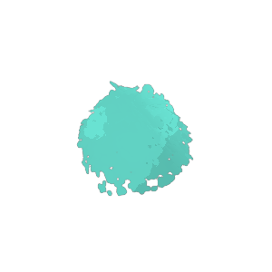
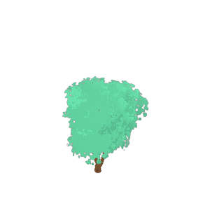

# Auto Tag Assets

Tests using OLLAMA and LLAVA for asset tagging and desription generation.

---

## Tests

---

**Asset**: apple

   

**Tags**: ['detached', 'constitutive', 'rednes', 'redness', 'blood red', 'simple', 'physical objects', 'agriculture departments', 'exemplaries', 'computer graphic', 'root', 'domain', 'tranquil', 'aerofoils', 'physical object', 'husbandry', 'natural', 'goodly', 'exemplary', 'sound', 'born', 'blues', 'translations', 'red hot']

**Description**: A red apple with a green stem on top

---

**Asset**: balsam_flower

   

**Tags**: ['tabular array', 'flowerpot', 'plate', 'dwelling', 'mesas', 'balsam flower', 'artificial decoration', 'plant for home', 'peck', 'passel', 'fake plant', 'ribbons', 'habitation', 'crapper', 'laurel wreath', 'plant with red flowers', 'internal', 'indoor plant', 'plates', 'balsam plant', 'works', 'decorative plant', 'heyday', 'potted plant']

**Description**: This image shows  of a plant with red flowers and green leaves

---

**Asset**: barbacue

   

**Tags**: ['folk', 'rootage', 'oxford gray', 'kin', 'patty', 'folks', 'outdoor cooking', 'cookout', 'root', 'field days', 'blackguard', 'assemblage', 'backyard', 'seeds', 'picnic', 'grillrooms', 'assembly', 'domestic dogs', 'encampment', 'meat', 'summertime', 'assemblages', 'nutrients', 'fusains']

**Description**: This image depicts  of a portable gas grill with a cart and wheels, placed on a black surface

---

**Asset**: beach_umbrella

   

**Tags**: ['cherry red', 'umbrella', 'rednes', 'article of furniture', 'aegis', 'colourful', 'viridity', 'super c', 'redness', 'blood red', 'simple', 'parasols', 'utilizations', 'wraiths', 'pliants', 'beach', 'folding', 'foldings', 'lightweight', 'forward lookings', 'appurtenants', 'orangenes', 'ancillaries', 'chicken']

**Description**: This image depicts a colorful umbrella with a red top and yellow body, standing on a white pole

---

**Asset**: bermuda_grass

   

**Tags**: ['focussing', 'form', 'solid ground', 'colourful', 'viridity', 'super c', 'styliseds', 'playing areas', 'exposures', 'cloudeds', 'easies', 'artistic', 'simple', 'present days', 'modern days', 'aesthetic', 'ornamental', 'abstract', 'acid', 'esthetical', 'pattern', 'cosmetics', 'synthetic substance', 'polygonal shapes']

**Description**: This image depicts  of a green grassy field with small yellow dots scattered throughout

---

**Asset**: bicycle_parking_rack

   

**Tags**: ['component part', 'contribution', 'share', 'arrangements', 'wheels', 'root', 'assemblage', 'substantials', 'stands', 'blueprints', 'assemblages', 'public bike rack', 'shares', 'system of rules', 'excogitation', 'parking rack', 'anatomical structure', 'fabrication', 'social organisations', 'wracks', 'facility', 'scheme', 'metal bike rack', 'component']

**Description**: This image depicts  of a bicycle parking rack

---

**Asset**: big_flat_rock

   

**Tags**: []

**Description**: This image depicts a large, flat rock with a smooth surface

---

**Asset**: big_mossy_rock

   

**Tags**: []

**Description**: This image depicts a large, greenish-brown egg with a cracked top, resembling a rock with moss growing on it

---

**Asset**: big_rock

   

**Tags**: ['instinctive', 'form', 'stony', 'monochromics', 'monochromes', 'jolties', 'rock and roll', 'globoses', 'harlan stones', 'smutties', 'rock music', 'bods', 'aerofoils', 'innates', 'configurations', 'similars', 'joltings', 'large rock', 'three dimensional', 'lifelikes', 'boundaries', 'natural', 'globular', 'lucy stone']

**Description**: This image depicts a large, spherical rock with a rough texture

---

**Asset**: big_stone

   

**Tags**: ['manakins', 'form', 'monochromics', 'simple', 'physical objects', 'rock and roll', 'interpreting', 'exemplaries', 'computer graphic', 'harlan stones', 'gray', 'pictorials', 'rock music', 'objectives', 'bods', 'aerofoils', 'greynes', 'physical object', 'substantials', 'configurations', 'hearty', 'interpretings', 'blueprints', 'computer graphics']

**Description**: This image depicts a large, gray, geometrically shaped object with a smooth surface

---

**Asset**: bird_fountain

   

**Tags**: ['tabular array', 'mesas', 'writing', 'dwelling', 'spring', 'methamphetamine hydrochloride', 'interior department', 'letter papers', 'habitation', 'deoxyephedrines', 'plates', 'upcountries', 'metallic element', 'bloodles', 'deoxyephedrine', 'white people', 'inners', 'forward lookings', 'meth', 'natural springs', 'playpens', 'glass', 'upcountry', 'minimalist']

**Description**: This image depicts a small white table with a blue pen on top, placed on a silver stand

---

**Asset**: birds_nest_fern

   

**Tags**: ['instinctive', 'constitutive', 'wild', 'viridity', 'super c', 'repose', 'lifetime', 'environment', 'ontogeny', 'equanimities', 'equanimity', 'out of doors', 'tranquil', 'innates', 'bronx cheer', 'folio', 'quietudes', 'calm air', 'habitat', 'peaceable', 'brute', 'quiet', 'ecosystem', 'surroundings']

**Description**: This image depicts  of a fern with three leaves

---

**Asset**: birds_nest_fern_container

   

**Tags**: ['flowerpot', 'standstill', 'boxwoods', 'peck', 'passel', 'crapper', 'boxwood', 'fake plant', 'bearers', 'verdure', 'office plant', 'boxful', 'container', 'indoor plant', 'plant holder', 'standstills', 'pot', 'works', 'point of view', 'decorative plant', 'pedestal', 'living room plant', 'potted plant', 'bandstand']

**Description**: This image depicts  of a small potted plant with green leaves and a brown pot

---

**Asset**: blue_bicycle

   

**Tags**: ['form', 'refuge', 'foot lever', 'well disposeds', 'utilizations', 'cog', 'frame', 'wheels', 'bum', 'sprocket wheel', 'paraphernalias', 'mountain range', 'tooshies', 'kickstand', 'exercise', 'range', 'mountain ranges', 'brackens', 'safety', 'cycles', 'rear ends', 'doorbells', 'geared wheels', 'roulette wheels']

**Description**: This image shows a blue bicycle with white wheels and an orange seat

---

**Asset**: blue_magic_stone

   

**Tags**: ['blasphemous', 'rhombus', 'puritanic', 'blue air', 'blue precious crystal blue', 'down in the mouth', 'blue diamond', 'watch glas', 'puritanics', 'blue precious magic diamond', 'pellucid', 'blue precious jewel', 'magic stone', 'blue crystalline', 'blue gemstone', 'blue airs', 'harlan f stones', 'blue precious gem', 'treasures', 'lechatelierite', 'blue precious diamond', 'harlan f stone', 'ball fields', 'limpid']

**Description**: A brown stone with a blue magic symbol on top

---

**Asset**: blue_table

   

**Tags**: ['tabular array', 'lightsome', 'mesas', 'article of furniture', 'insipid', 'simple', 'unmistakable', 'champaign', 'unmistakables', 'insipids', 'forward lookings', 'aerofoils', 'flat', 'coloration', 'blueprints', 'tabular arrays', 'sheers', 'canonicals', 'dim witted', 'piece of furniture', 'innovative', 'modern fonts', 'person of colour', 'stages']

**Description**: A simple, flat-topped table with four legs

---

**Asset**: boombox

   

**Tags**: ['colourful', 'majestic', 'ornamental', 'old fashioned', 'cosmetics', 'boxlikes', 'time of origin', 'euphony', 'electronic', 'retro', 'sport', 'concordats', 'miniature', 'merriment', 'vintage', 'playfulnes', 'cosmetic', 'speaker', 'stereophony', 'toy', 'majestics', 'box shapeds', 'nostalgic', 'radio receivers']

**Description**: A purple boombox with a red button on top

---

**Asset**: brown_bicycle

   

**Tags**: ['form', 'pipe', 'seatpost', 'foot lever', 'wheel spoke', 'flanges', 'bum', 'frame', 'wheels', 'electron tubes', 'taillight', 'paraphernalias', 'mountain range', 'electron tube', 'tooshies', 'fork', 'kickstand', 'ramifications', 'bicycle seat', 'range', 'mountain ranges', 'headlight', 'crotch', 'rundle']

**Description**: This image shows  of a brown bicycle with white wheels and a wooden seat

---

**Asset**: bush

   

**Tags**: ['instinctive', 'constitutive', 'shrubbery', 'form', 'viridity', 'super c', 'down to earth', 'lifetime', 'environment', 'ontogeny', 'pubic hair', 'alivenes', 'bods', 'innates', 'coloration', 'configurations', 'out of door', 'george walker bushes', 'surroundings', 'super cs', 'lifelikes', 'natural', 'industrial plants', 'refreshfuls']

**Description**: a green leafy plant with multiple leaves

---

**Asset**: bush_empty_land_1

   

**Tags**: ['slackenings', 'instinctive', 'escape', 'constitutive', 'solid ground', 'restrained', 'wild', 'leakage', 'tramp', 'chiliad', 'viridity', 'playing areas', 'super c', 'repose', 'empty bellied', 'environment', 'lifetime', 'restraineds', 'groves', 'common', 'ontogeny', 'pubic hair', 'agriculture departments', 'privacy']

**Description**: a blue, abstract 3D object

---

**Asset**: bush_empty_land_2

   

**Tags**: ['manakins', 'solid ground', 'form', 'colourful', 'viridity', 'super c', 'empty bellied', 'environment', 'physical objects', 'ontogeny', 'pubic hair', 'synthetic substance', 'exemplaries', 'interpreting', 'computer graphic', 'vacuous', '3d', 'three ds', 'pictorials', 'fine arts', 'objectives', 'bods', 'physical object', 'contriveds']

**Description**: This image depicts a small, green tree with no leaves or branches

---

**Asset**: cactus

   

**Tags**: ['computing machines', 'representative', 'thorns', 'attractors', 'pel', 'manakins', 'viridity', 'styliseds', 'super c', 'thorn', 'exposures', 'symbolization', 'iconic', 'cactus drawing', 'instance', 'picture elements', 'isometric line', 'mark', 'backcloths', 'attractor', 'interpreting', 'computer softwares', 'southwestern', 'cactus photo']

**Description**: This image shows  of a green cactus

---

**Asset**: cafe_street_sign

   

**Tags**: ['hrs', 'signed', 'term', 'monetary value', 'eating places', 'restaurants', 'nook', 'quoins', 'eating place', 'card', 'price', 'computer menus', 'emplacements', 'drink', 'job', 'coffee bars', 'mark', 'coffee shops', 'minutes', 'street corner', 'corner', 'populace', 'costs', 'house']

**Description**: This image shows a digital rendering of a chalkboard sign with three sections, each containing different colored lines or shapes, placed on an easel against a green background

---

**Asset**: campfire

   

**Tags**: ['slackenings', 'lightsome', 'tramp', 'wild', 'pin', 'solemnisation', 'jubilation', 'sir henry joseph woods', 'repose', 'sociable', 'ellen price wood', 'heat', 'bonfire', 'endurance', 'festivities', 'societal', 'hike', 'mixers', 'assemblage', 'gathering', 'ellen price woods', 'assembly', 'heats', 'passion']

**Description**: A digital 3D rendering of a campfire with flames and a small pile of wood

---

**Asset**: camping_board

   

**Tags**: ['article of furniture', 'form', 'across the board', 'outdoor furniture', 'pull out bed', 'corner bed', 'frame', 'camping gear', 'trundle bed', 'paraphernalias', 'chaise', 'unmade bed', 'geared wheels', 'paraphernalia', 'gear wheel', 'gear wheels', 'twin bed', 'piece of furniture', 'travel bed', 'crib', 'builds', 'wooden bed', 'all embracing', 'bottoms']

**Description**: This image depicts a simple, cartoon-style wooden bed frame with a green board attached to the top

---

**Asset**: camping_table

   

**Tags**: ['tabular array', 'mesas', 'usable', 'form', 'article of furniture', 'tramp', 'simple', 'protein folding', 'rescue', 'frame', 'toughs', 'long wearings', 'folding', 'metallic element', 'foldings', 'lightweight', 'operable', 'hike', 'field days', 'exaltations', 'usables', 'variou', 'picnic', 'determination']

**Description**: A blue foldable camping table

---

**Asset**: cat_statue

   

**Tags**: ['felid', 'carnal', 'felids', 'form', 'methamphetamine hydrochloride', 'manakins', 'ceramic', 'deoxyephedrines', 'carving', 'statuettes', 'physical objects', 'ornamental', 'ceramic figurine', 'glass sculpture', 'feline', 'cosmetics', 'deoxyephedrine', 'exemplaries', 'meth', 'fine arts', 'bods', 'objectives', 'glass', 'physical object']

**Description**: a cat statue on top of a box

---

**Asset**: centipede_grass

   

**Tags**: ['instinctive', 'constitutive', 'solid ground', 'wild', 'colourful', 'viridity', 'super c', 'playing areas', 'down to earth', 'lifetime', 'environment', 'equanimities', 'equanimity', 'tranquil', 'innates', 'calm air', 'basis', 'elaborate', 'peaceable', 'rural', 'out of door', 'brute', 'quiet', 'surroundings']

**Description**: This image depicts a green, grassy field with a centipede crawling across it

---

**Asset**: checkered_rug

   

**Tags**: ['dodge', 'form', 'lustrelessnes', 'gym mats', 'rectangular shape', 'dodgings', 'no fringe', 'interference fringes', 'artistic', 'esthetical', 'lustrelessness', 'bods', 'aerofoils', 'modern aesthetic', 'configurations', 'expressive style', 'ornament', 'blueprints', 'outlines', 'matted', 'indoor decoration', 'rule', 'outer boundaries', 'aestheticals']

**Description**: This image depicts a red and white checkered rug with fringe on the edges

---

**Asset**: chest

   

**Tags**: ['cays', 'door latches', 'grasp', 'underdrawers', 'chest with clasp', 'clench', 'drawers', 'thorax', 'samara', 'chest with handle and keyhole', 'pant', 'palpebra', 'hat', 'combining', 'compounding', 'chest with lock and key', 'grips', 'combinings', 'flexible joints', 'palpebras', 'eyelids', 'chest with hinges', 'winders', 'hats']

**Description**: A brown wooden chest with a handle on top

---

**Asset**: classic_bench

   

**Tags**: ['peck', 'sir henry joseph woods', 'seance', 'ellen price wood', 'backcloths', 'stage setting', 'judiciaries', 'scope', 'kens', 'seateds', 'judiciary', 'ellen price woods', 'empty space', 'pecks', 'blueprints', 'posing', 'seances', 'backcloth', 'wooden slats', 'stages', 'excogitation', 'mounts', 'outdoor bench', 'ken']

**Description**: This image depicts a simple, wooden park bench with two slats on the backrest

---

**Asset**: classic_lamp_post

   

**Tags**: ['yellow light bulb', 'lightsome', 'foundation', 'electric lights', 'illuminance', 'urban fixture', 'tract', 'elucidations', 'incandescent lamps', 'feet', 'nucleotides', 'electric light bulbs', 'nerve pathways', 'footpath', 'world', 'expressive style', 'tracts', 'firings', 'earth', 'miniature', 'trend', 'kindling', 'illuminances', 'ingredients']

**Description**: This image depicts  of a classic-style lamp post with a single light fixture on top

---

**Asset**: classroom_chair

   

**Tags**: ['minimalist stool', 'modern stool', 'article of furniture', 'crapper', 'school chair', 'bums', 'simple stool', 'contemporary stool', 'modern chair', 'red chair', 'toilets', 'plain stool', 'bum', 'as', 'plain chair', 'rear end', 'toilet', 'minimalist chair', 'ass', 'tooshies', 'tooshie', 'wooden chair', 'simple chair', 'rear ends']

**Description**: This image shows a red chair with a wooden seat

---

**Asset**: clay_pot

   

**Tags**: ['representative', 'manakins', 'peck', 'crapper', 'instance', 'physical objects', '3d illustration', 'jounce', 'interpreting', 'exemplaries', 'decorative vase', 'computer graphic', 'fine arts', 'objectives', 'physical object', 'table centerpiece', 'pottery art', 'pecks', 'interpretings', 'blueprints', 'computer graphics', 'crappers', 'exemplary', 'jarfuls']

**Description**: This image shows a red clay pot with a handle on top

---

**Asset**: cobblestone

   

**Tags**: ['usable', 'instinctive', 'form', 'metropoli', 'monochromics', 'impersonal', 'computer architectures', 'orthogonals', 'simple', 'down to earth', 'authoritatives', 'greco romen', 'brick', 'sore', 'toughs', 'bare ass', 'dateless', 'inert', 'long wearings', 'pattern', 'operable', 'furrowed', 'harlan stones', 'aerofoils']

**Description**: This image depicts a close-up view of a textured surface resembling cobblestones

---

**Asset**: coffee_table

   

**Tags**: ['tabular array', 'usable', 'mesas', 'top of the inning', 'article of furniture', 'insipid', 'methamphetamine hydrochloride', 'nook', 'english', 'quoins', 'sir henry joseph woods', 'simple', 'streamlineds', 'deoxyephedrines', 'inclines', 'ornamental', 'ellen price wood', 'cosmetics', 'deoxyephedrine', 'insipids', 'forward lookings', 'meth', 'operable', 'street corner']

**Description**: This image depicts a simple, square wooden coffee table with four legs

---

**Asset**: coin_gecko_pot

   

**Tags**: ['cherry red', 'favored', 'rednes', 'dwelling', 'manakins', 'peck', 'witchings', 'crapper', 'interior department', 'cunnings', 'chiliad', 'viridity', 'adorable', 'duckies', 'redness', 'blood red', 'habitation', 'super c', 'witching', 'capricious', 'plates', 'amphibiou', 'statuettes', 'magicals']

**Description**: A green gecko figurine in a red pot

---

**Asset**: coin_gecko_statue

   

**Tags**: ['civilizations', 'carnal', 'manakins', 'singular', 'styliseds', 'finish', 'unparalleled', 'carving', 'statuettes', 'workmanship', 'theatrical role', 'variants', 'gimpies', 'exemplaries', 'fine arts', 'polishes', 'fancy', 'crippled', 'phantasies', 'fictional character', 'polish', 'elaborate', 'ornament', 'detail']

**Description**: This image depicts  of a gecko statue with a coin-like appearance

---

**Asset**: concrete

   

**Tags**: ['stops', 'linguistic context', 'context of use', 'computer architectures', 'acid', 'technology', 'applied sciences', '11 structure', 'auction blocks', '4 brick', '18 design', 'rampart', 'substantials', 'instauration', 'basis', 'editorial', 'blueprints', 'tower', '9 column', 'cementums', '17 engineering', 'foundation garments', 'structure', 'excogitation']

**Description**: a snowy landscape with a focus on a concrete structure

---

**Asset**: concrete_rounded_table

   

**Tags**: ['round of drinks', 'beat', 'usable', 'dwelling', 'tabular array', 'mesas', 'article of furniture', 'foundation', 'habitation', 'simple', 'plates', 'ornamental', 'feet', 'nucleotides', 'cosmetics', 'plinths', 'operable', 'forward lookings', 'domain', 'usables', 'greynes', 'elbow rooms', 'fields', 'zane greys']

**Description**: This image shows a small round table with a metal base

---

**Asset**: concrete_square_planter

   

**Tags**: ['boxwoods', 'concrete', 'boxwood', 'straight', 'solid', 'boxful', 'square', 'planter', 'plantation owners', 'planter box square concrete', 'planter box concrete', 'corner', 'loges', 'planter box square', 'planter box', 'hearty', 'satisfying', 'planter box concrete square planter', 'boxfuls', 'loge', 'corners', 'solids', 'hearties', 'satisfyings']

**Description**: This image depicts a simple, gray, square planter with a hole in the top for planting

---

**Asset**: construction_cone

   

**Tags**: ['lightsome', 'elevator cars', 'refuge', 'signed', 'manakins', 'motortruck', 'situation', 'precaution', 'marker', 'well disposeds', 'symbolization', 'workplaces', 'highway', 'physical objects', 'geographical zones', 'pliants', 'bloodles', 'mark', 'exemplaries', 'white people', 'computer graphic', 'domain', 'signal', 'symbolizations']

**Description**: This image shows a red construction cone with a white stripe on top

---

**Asset**: construction_fence

   

**Tags**: ['stops', 'refuge', 'signed', 'blockage device', 'obstructors', 'geographical zones', 'mark', 'exemplaries', 'roadblocks', 'auction blocks', 'house', 'diversionary attack', 'roadblock', 'encirclement', 'caution sign', 'ascendancy', 'gag law', 'exemplary', 'refuges', 'admonition', 'safety barrier', 'fencing', 'structure', 'mastery']

**Description**: A digital 3D model of a portable construction fence

---

**Asset**: construction_ladder

   

**Tags**: ['usable', 'untarnisheds', 'measure', 'uninsulated', 'simple', 'metallic element', 'operable', 'unoccupied', 'gray', 'usables', 'greynes', 'uncolored', 'minimalist', 'canonicals', 'louis harold gray', 'dim witted', 'stainles', 'stairs', 'uncoloureds', 'meres', 'workings', 'whole steps', 'greyness', 'unadorneds']

**Description**: This image depicts a simple, three-step wooden ladder with a flat top

---

**Asset**: construction_light

   

**Tags**: ['lightsome', 'cleverness', 'focussing', 'newsflash', 'split second', 'professional people', 'illuminance', 'elucidations', 'studio apartments', 'seizures', 'case', 'emplacements', 'split seconds', 'point of view', 'bandstand', 'stage setting', 'newsflashes', 'scope', 'directions', 'clevernes', 'event', 'locales', 'vista', 'professional person']

**Description**: This image shows a yellow tripod

---

**Asset**: construction_materials

   

**Tags**: ['instinctive', 'article of furniture', 'diy', 'sir henry joseph woods', 'plank', 'ellen price wood', 'woodwork', 'voluptuou', 'lumber', 'horizontal', 'unioniseds', 'upright', 'innates', 'assemblage', 'rampart', 'meliorations', 'substantials', 'ellen price woods', 'indoor', 'assembly', 'out of door', 'betterments', 'flooring', 'floor']

**Description**: This image depicts a collection of wooden planks in various orientations

---

**Asset**: construction_metal_fence

   

**Tags**: ['refuge', 'unbendings', 'gravellies', 'smoothing irons', 'pole', 'roadblocks', 'exaltations', 'rentals', 'protective', 'installation', 'ascendancy', 'mend', 'reposition', 'perdurable', 'raptures', 'barriers', 'fastener', 'durable', 'hardy', 'fence', 'holdfast', 'alloy', 'hardies', 'criminal maintenances']

**Description**: This image depicts  of a metal fence, which appears to be a temporary barrier or barricade

---

**Asset**: construction_site

   

**Tags**: ['mitts', 'aegis', 'refuge', 'methamphetamine hydrochloride', 'wild', 'precaution', 'situation', 'under construction', 'geographical zones', 'bucks', 'spyglas', 'the boot', 'mark', 'methamphetamines', 'refurbishment', 'boxing glove', 'roadblocks', 'domain', 'upkeep', 'safety', 'hat', 'stagings', 'web sites', 'vehicle']

**Description**: This image depicts  of a construction site with various equipment and materials

---

**Asset**: dandelion

   

**Tags**: ['saltation', 'constitutive', 'goodlies', 'rootage', 'spring', 'electric lights', 'vegetable', 'green grocery', 'viridity', 'playing areas', 'super c', 'root words', 'incandescent lamps', 'leaps', 'ontogeny', 'agriculture departments', 'heyday', 'root', 'farming', 'natural springs', 'electric light bulbs', 'veggies', 'flower', 'stem turns']

**Description**: This image shows a digital rendering of a dandelion with four carrot-like flowers

---

**Asset**: dark_cobblestone

   

**Tags**: ['solid ground', 'story', '13 architectural', 'harlan stones', 'three ds', '16 urban', 'aerofoils', 'cobble', 'greynes', 'substantials', 'basis', 'zane greys', 'elaborate', 'sett', 'flooring', '11 realistic', 'cobbles', '18 cityscape', 'dingies', 'lucy stone', 'earth', '17 historical', 'historics', 'elaborated']

**Description**: This image depicts  of a cobblestone floor with a dark color scheme

---

**Asset**: dcl_logo

   

**Tags**: ['whiteness', 'excogitation', 'logotype', 'symbolisations', 'white person', 'stanford white', 'bloodless', 'simulacrums', 'representative', 'images', 'symbolization', 'exemplification', 'symbolic representation', 'symbolic representations', 'instance', 'whitenes', 'digital illustration', 'plan', 'prototype', 'symbolisation', 'bloodles', 'ikons', 'allegories', 'figure']

**Description**: a logo

---

**Asset**: deck_chair

   

**Tags**: ['cherry red', 'instinctive', 'rednes', 'article of furniture', 'colourful', 'easies', 'redness', 'sir henry joseph woods', 'blood red', 'simple', 'backrest', 'casual', 'ellen price wood', 'armrest', 'homy', 'forward lookings', 'intimates', 'seating areas', 'innates', 'substantials', 'well to do', 'ellen price woods', 'minimalist', 'out of door']

**Description**: This image shows a red chair with wooden arms and legs

---

**Asset**: dining_chair

   

**Tags**: ['tabular array', 'usable', 'mesas', 'dwelling', 'article of furniture', 'interior department', 'crapper', 'habitation', 'simple', 'plates', 'toilets', 'upcountries', 'operable', 'forward lookings', 'inners', 'seating areas', 'usables', 'elbow rooms', 'upcountry', 'chicken', 'patch', 'coloration', 'substantials', 'scandalmongering']

**Description**: A simple wooden chair with a yellow seat

---

**Asset**: dirt

   

**Tags**: ['instinctive', 'solid ground', 'stony', 'wild', 'down to earth', 'sore', 'fierce', 'cold', 'bare ass', 'stales', 'jolties', 'specked', 'desolate', 'wries', 'ironicals', 'dotteds', 'scratchies', 'stale', 'aerofoils', 'innates', 'flecked', 'basis', 'dusty', 'desiccated']

**Description**: a close-up of a textured surface resembling dirt with small dots representing grains or particles

---

**Asset**: dog_statue

   

**Tags**: ['stops', 'foundation', 'dog on pedestal', 'manakins', 'dog decoration', 'boxwood', 'dog on speaker', 'carving', 'dog trophy', 'statuettes', 'dog plaque', 'feet', 'point of view', 'programs', 'dog model', 'nucleotides', 'bandstand', 'plinths', 'exemplaries', 'decorations', 'auction blocks', 'corner', 'plinth', 'stands']

**Description**: This image is a thumbnail of a 3D asset depicting a small white dog statue sitting on top of a cake-shaped pedestal

---

**Asset**: empty_wheelbarrow

   

**Tags**: ['cherry red', 'streetcar', 'rednes', 'garden carts', 'charless wain', 'project', 'trolley cars', 'redness', 'blood red', 'simple', 'empty bellied', 'workplaces', 'transport', 'wheels', 'pliants', 'station waggons', 'utility grades', 'vacuous', 'public service corporations', 'exaltations', 'tramcar', 'projects', 'vehicle', 'roulette wheels']

**Description**: A red wheelbarrow with two wheels

---

**Asset**: evergreen_shrub

   

**Tags**: ['undecomposed', 'instinctive', 'dotties', 'constitutive', 'goodlies', 'restrained', 'wild', 'baseless', 'viridity', 'renewable', 'super c', 'reclusive', 'well disposeds', 'flourishing', 'lifetime', 'environment', 'racy', 'restraineds', 'sore', 'flourishings', 'recurrent', 'toughs', 'boomings', 'bare ass']

**Description**: This image depicts a green turtle with a geometric design

---

**Asset**: fair_kiosk

   

**Tags**: ['outdoor booth', 'market stall', 'standstill', 'showings', 'john wilkes booths', 'handcarts', 'shop clas', 'booths', 'workshop', 'small pavilion', 'outdoor display', 'cubicles', 'portable booth', 'pushcart', 'collapsible shelters', 'protections', 'kiosk', 'marquee', 'presentation', 'standstills', 'workshops', 'fairground stand', 'stores', 'tax shelter']

**Description**: This image depicts a colorful red kiosk with a wooden roof, featuring a small counter inside and a sign hanging from the front

---

**Asset**: fence_door

   

**Tags**: ['instinctive', 'dwelling', 'aegis', 'chiliad', 'habitation', 'sir henry joseph woods', 'authoritatives', 'greco romen', 'plates', 'seclusions', 'ornamental', 'holdings', 'ellen price wood', 'privacy', 'enclosure', 'cosmetics', 'horizontal', 'upright', 'innates', 'backyard', 'natural enclosure', 'sentries', 'ks', 'substantials']

**Description**: This image depicts  of a wooden picket fence with a door

---

**Asset**: fence_end_module

   

**Tags**: ['textile', 'building material', 'rectangular', 'article of furniture', 'spot', 'erect', 'anatomical structure', 'musical composition', 'social organisations', 'outdoor furniture', 'mental faculties', 'construction', 'vertical', 'module', 'fence post', 'orthogonals', 'social organisation', 'patches', 'laurel wreath', 'brick', 'end piece', 'c w post', 'yard decoration', 'orthogonal']

**Description**: This image shows a brown wooden post

---

**Asset**: fire_hydrant

   

**Tags**: ['cherry red', 'rednes', 'water tower', 'ruby', 'redness', 'blood red', 'pillars', 'taps', 'hydrant', 'water faucet', 'tap', 'tugboats', 'column', 'tugboat', 'rubies', 'red', 'columns', 'pillar', 'water tap', 'fire hydrant', 'tug', 'blood reds', 'tugs', 'cherry reds']

**Description**: This image shows a red 3D model of a fire hydrant with two nozzles on top

---

**Asset**: flat_medium_stone

   

**Tags**: ['representative', 'form', 'insipid', 'simple', 'modern days', 'physical objects', 'metier', 'exemplaries', 'computer graphic', 'forward lookings', 'realities', 'harlan stones', 'gray', 'rock music', 'tranquil', 'aerofoils', 'data processors', 'physical object', 'minimalist', 'coevals', 'digital', 'exemplary', 'translations', 'clas']

**Description**: This image depicts a gray, flat, medium-sized stone

---

**Asset**: flat_pebble

   

**Tags**: ['form', 'insipid', 'monochromics', 'simple', 'unmistakable', 'physical objects', 'champaign', 'abstract', 'unmistakables', 'insipids', 'forward lookings', 'computer graphic', 'pictorials', 'objectives', 'bods', 'flat', 'physical object', 'minimalist', 'configurations', 'graphic flat', 'monochrome shape', 'blueprints', 'outlines', 'computer graphics']

**Description**: This image depicts a simple, flat, pebble-like object with a smooth surface

---

**Asset**: flower_crop

   

**Tags**: ['rootage', 'finish', 'seedling', 'nurseries', 'filths', 'turd', 'ontogeny', 'agriculture departments', 'territory', 'heyday', 'farming', 'polishes', 'flower', 'glasshouses', 'polish', 'cultures', 'flowers', 'solutions', 'sprouts', 'husbandry', 'husbandries', 'industrial plants', 'efflorescence', 'harvest']

**Description**: This image depicts  of a row of flowers planted in a long, brown planter

---

**Asset**: flower_sprouts

   

**Tags**: ['bow', 'point', 'fake flowers', 'ribbons', 'laurel wreath', 'root words', 'indoor plant', 'tokens', 'works', 'details', 'green stems', 'bows', 'heyday', 'red flowers', 'blossoms', 'root', 'home decor', 'flora', 'efflorescences', 'tabletop flower', 'particular', 'festive decor', 'heydays', 'holiday decor']

**Description**: This image depicts a digital 3D model of three red flowers with green stems against a plain background

---

**Asset**: folding_chair

   

**Tags**: ['slackenings', 'article of furniture', 'relief', 'easies', 'leisurely', 'simple', 'repose', 'casual', 'beach', 'folding', 'foldings', 'lightweight', 'field days', 'intimates', 'rest', 'lounger', 'backyard', 'picnic', 'vacation', 'well to do', 'minimalist', 'out of door', 'encampment', 'presidents']

**Description**: This image shows a blue folding chair with a wooden frame

---

**Asset**: folding_stool

   

**Tags**: ['usable', 'weapon system', 'article of furniture', 'crapper', 'simple', 'backrest', 'protein folding', 'rescue', 'bum', 'toilets', 'atomic number 47S', 'toughs', 'long wearings', 'folding', 'metallic element', 'weaponry', 'lightweight', 'operable', 'tooshies', 'seating areas', 'smutties', 'usables', 'rear ends', 'variou']

**Description**: This image shows a black folding stool with four legs

---

**Asset**: for_sale_sign

   

**Tags**: ['signed', 'residential property for sale sign', 'houses', 'lakefront property for sale sign', 'signeds', 'signboards', 'city property for sale sign', 'house for sale sign', 'beachfront property for sale sign', 'rural property for sale sign', 'country property for sale sign', 'mark', 'home for sale sign', 'waterfront property for sale sign', 'house', 'signboard', 'real estate sign', 'urban property for sale sign', 'commercial property for sale sign', 'mountain property for sale sign', 'marks', 'real estate listing sign', 'property for sale sign', 'land for sale sign']

**Description**: This image depicts  of a real estate sign with the text "FOR SALE" on it

---

**Asset**: fruit_kiosk

   

**Tags**: ['tabular array', 'replication', 'mesas', 'sideboard', 'securities industries', 'shop clas', 'boxwood', 'cools', 'cubicles', 'fruit counter', 'point of view', 'fruit shop', 'vender', 'memories', 'bandstand', 'auto', 'corner', 'fruit crate', 'binful', 'nerveles', 'fruit table', 'cars', 'field goal', 'basketfuls']

**Description**: A colorful fruit stand with various fruits on display

---

**Asset**: geodesic_dome

   

**Tags**: ['geodesic dome', 'manakins', 'interior department', 'colourful', 'artistic', 'simple', 'bonces', 'aesthetic', 'ornamental', 'pliants', 'upcountries', 'bleached', 'covered stadium', 'cosmetics', 'lightweight', 'inners', 'forward lookings', 'interpreting', 'exemplaries', 'clear material', 'round eyeds', 'globoses', 'upcountry', 'substantials']

**Description**: This image depicts a colorful, geometric dome structure with a central hole

---

**Asset**: grass_row

   

**Tags**: ['true', 'measure', 'insipid', 'symbolization', 'orthogonals', 'simple', 'unmistakable', 'physical objects', 'champaign', 'narrow', 'yard measures', 'narrow mindeds', 'minutes', 'insipids', 'computer graphic', 'unmistakables', 'symbolizations', 'pictorials', 'objectives', 'flat', 'physical object', 'minimalist', 'hearty', 'digital']

**Description**: This image shows a green bar with a gray stripe on top, which appears to be  of a ruler or measuring tool

---

**Asset**: grass_sprout

   

**Tags**: ['instinctive', 'constitutive', 'viridity', 'super c', 'seedling', 'finish', 'environment', 'groves', 'ontogeny', 'agriculture departments', 'farm', 'polishes', 'innates', 'folio', 'polish', 'cultures', 'out of door', 'eco', 'surroundings', 'super cs', 'husbandry', 'natural', 'lifelikes', 'husbandries']

**Description**: This image depicts  of a sprouting green plant

---

**Asset**: grass_tile

   

**Tags**: ['representative', 'form', 'manakins', 'styliseds', 'simple', 'instance', 'pallet', 'abstract', 'mathematical functions', 'isometric line', 'interpreting', 'exemplaries', 'computer graphic', 'forward lookings', 'single valued functions', 'fine arts', 'pictorials', 'bods', 'aerofoils', 'coloration', 'configurations', 'tile pattern', 'interpretings', 'blueprints']

**Description**: This image depicts  of a green grass tile

---

**Asset**: green_magic_stone

   

**Tags**: ['mystic', 'form', 'viridity', 'super c', 'symbolization', 'physical objects', 'magicals', 'fascinations', 'symbolizations', 'harlan stones', 'objectives', 'fancy', 'crystal', 'aerofoils', 'supernatural', 'bods', 'physical object', 'substantials', 'watch glass', 'phantasies', 'conjuring trick', 'configurations', 'mysteriou', 'ornament']

**Description**: A three-dimensional model of a green magic stone with a glowing symbol on top

---

**Asset**: green_poplars

   

**Tags**: ['torsos', 'representative', 'detached', 'elevated railway', 'impersonal', 'distorteds', 'restraineds', 'crinkly', 'acerate leaves', 'boomings', 'problematic', 'equanimities', 'broad', 'exemplaries', 'root', 'computer graphic', 'tranquil', 'secluded', 'hilly', 'secrets', 'craggy', 'shade', 'digital', 'grandiloquent']

**Description**: This image shows  of a tree

---

**Asset**: green_rounded_pine_tree

   

**Tags**: ['manakins', 'insipid', 'monochromics', 'styliseds', 'simple', 'environment', 'monochromes', 'abstract', 'ontogeny', 'synthetic substance', 'exemplaries', 'insipids', 'blockish', 'coniferous tree', 'forward lookings', 'computer graphic', '3d', 'three ds', 'pictorials', 'round eyeds', 'boxlikes', 'flat', 'contriveds', 'minimalist']

**Description**: This image shows  of a rounded pine tree with a simple, stylized design

---

**Asset**: green_rounded_pine_tree_2

   

**Tags**: ['round of drinks', 'beat', 'viridity', 'super c', 'ontogeny', 'pine tree', 'coniferous tree', 'pine', 'cone bearings', 'beats', 'super cs', 'evergreen plants', 'tree growth nature', 'growings', 'twoes', 'offsets', 'increments', 'timbers', 'tree diagram', 'tree growth leaves', 'legs', 'iis', 'evergreen plant', 'growing']

**Description**: This image shows a stylized, cartoon-like 3D model of a pine tree with a rounded top and a simple texture

---

**Asset**: green_sycamore_tree

   

**Tags**: ['great maple', 'pin', 'free fall', 'environment', 'falls', 'nightfall', 'sycamore tree', 'tree in autumn', 'ontogeny', 'deciduous tree in nature', 'out of doors', 'tree in forest', 'deciduous tree in fall', 'broad leaved', 'tree in woodland', 'deciduous tree in seasonal', 'surroundings', 'evenfalls', 'industrial plants', 'growings', 'platans', 'free falls', 'deciduous tree in autumn', 'offsets']

**Description**: This image depicts  of a sycamore tree with a simple, stylized design

---

**Asset**: green_tall_squared_tree

   

**Tags**: []

**Description**: This image depicts a stylized, simplistic 3D model of a tree with a square base and a simple, geometric design

---

**Asset**: gypsy_mushroom

   

**Tags**: ['cherry red', 'representative', 'umbrella', 'rednes', 'singular', 'colourful', 'styliseds', 'redness', 'blood red', 'artistic', 'unparalleled', 'capricious', 'present days', 'modern days', 'aesthetic', 'gays', 'instance', 'ornamental', 'toon', 'abstract', 'festive', 'offbeats', 'cosmetics', 'computer graphic']

**Description**: This image shows a red umbrella-like object with a brown stem

---

**Asset**: hammock

   

**Tags**: ['slackenings', 'forget me drug', 'article of furniture', 'colourful', 'easies', 'circle', 'simple', 'repose', 'rescue', 'beach', 'folding', 'long wearings', 'foldings', 'lightweight', 'weather resistant', 'forward lookings', 'variou', 'travelings', 'vacation', 'well to do', 'minimalist', 'out of door', 'encampment', 'rope']

**Description**: This image depicts a colorful hammock with a checkered pattern on its surface

---

