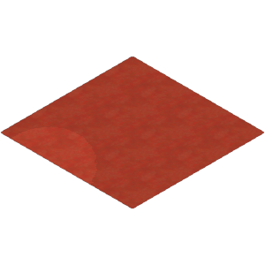
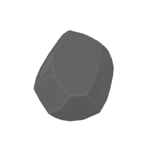
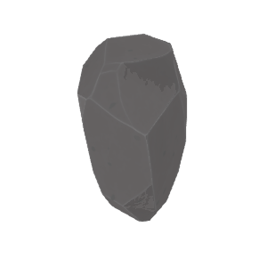
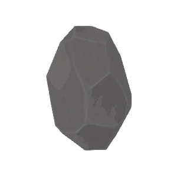
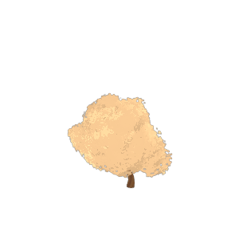
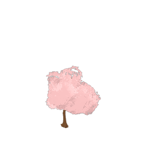
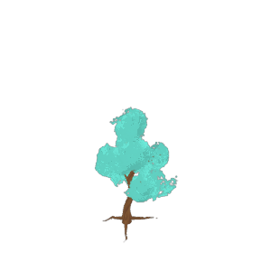

# Auto Tag Assets

Tests using OLLAMA and LLAVA for asset tagging and desription generation.

---

## Tests

---

**Asset**: apple

   

**Tags**: {'vibrant', 'colorful', 'apple', 'tree', 'organic', 'produce', 'round', 'healthy', 'juicy', 'seasonal', 'still life', 'minimalist', 'orchard', 'food', 'harvest', 'fresh', 'edible', 'red', 'simple', 'fruit'}

**Description**: A red apple.

---

**Asset**: balsam_flower

   

**Tags**: {'fauna', 'flower', 'flora', 'pot', 'garden', 'plant life', 'spring', 'nature', 'ecosystem', 'stem', 'flowers', 'potted', 'green', 'plant', 'seasonal', 'environment', 'summer', 'leaves', 'outdoor', 'gardening', 'decoration', 'bloom', 'landscape', 'botanical', 'red', 'fall', 'balsam flower'}

**Description**: A plant with red flowers and green leaves.

---

**Asset**: barbacue

   

**Tags**: {'picnic table', 'cookout', 'grilling food', 'summertime', 'camping', 'backyard barbecue grill', 'outdoor cooking', 'grilled vegetables', 'backyard barbecue', 'sausages', 'barbecue grill', 'gas grill', 'leisure activity', 'social gathering', 'hamburgers', 'hot dogs', 'outdoor furniture', 'propane grill', 'family event', 'charcoal grill', 'portable grill', 'patio set'}

**Description**: A barbecue grill with food on it.

---

**Asset**: beach_umbrella

   

**Tags**: {'umbrella', 'enjoyment', 'vibrant', 'orange', 'colorful', 'white', 'travel', 'shelter', 'foldable', 'lightweight', 'compact', 'plastic', 'vacation', 'resort', 'fun', 'relaxation', 'sun protection', 'holiday', 'sandy beach', 'coastal', 'portable', 'summer', 'waterfront', 'seaside', 'tourism', 'outdoor', 'pink', 'sun', 'easy to carry', 'leisure', 'beach', 'red', 'yellow', 'shade', 'recreation'}

**Description**: A colorful umbrella with a yellow top and red bottom, standing on a white pole.

---

**Asset**: bermuda_grass

   

**Tags**: {'bright background', 'bermuda grass', 'dynamic', 'cheerful background', 'vibrant', 'colorful', 'plants', 'speckled background', 'populous with dots background', 'vibrant background', 'populated with dots', 'vivid', 'lively', 'speckled', 'crowded background', 'nature', 'populous with dots', 'field', 'dotted', 'dense background', 'surface', 'pattern', 'ground', 'green', 'bustling background', 'polka dot background', 'background', 'cheerful', 'full background', 'populated', 'populous', 'outdoor', 'energetic', 'packed background', 'vegetation', 'full', 'lively background', 'landscape', 'active background', 'dynamic background', 'grass', 'polka dot', 'bustling', 'packed', 'vivid background', 'dotted background', 'dense', 'populated with dots background', 'texture', 'bright', 'colorful background', 'energetic background', 'active', 'crowded'}

**Description**: Green grass with a polka dot pattern.

---

**Asset**: bicycle_parking_rack

   

**Tags**: {'tiered compartment', 'compartment', 'rack', 'multi tiered space', 'container', 'tiered shelf', 'structure', 'item', 'tiered', 'tier', 'partition', 'tiered partition', 'tiered compartmentalization', 'space', 'arrangement', 'tiered design', 'multi tiered utility', 'multi tiered division', 'row', 'column', 'multi tiered storage', 'multi tiered unit', 'multi tiered partition', 'tiered tier', 'multi tiered', 'multi tiered rack', 'multi tiered design', 'tiered row', 'multi tiered compartmentalization', 'tiered column', 'level', 'multi tiered shelf', 'multi tiered compartment', 'tiered storage', 'organization', 'tiered arrangement', 'division', 'utility', 'tiered item', 'tiered level', 'multi tiered level', 'multi tiered container', 'tiered division', 'compartmentalization', 'multi tiered column', 'multi tiered tier', 'storage', 'tiered space', 'design', 'multi tiered item', 'tiered unit', 'tiered container', 'multi tiered structure', 'multi tiered row', 'unit', 'tiered utility', 'multi tiered arrangement', 'shelf', 'tiered structure', 'tiered rack'}

**Description**: A bicycle parking rack.

---

**Asset**: big_flat_rock

   

**Tags**: {'geology', 'stone', 'alone', 'space', 'isolation', 'rough', 'natural', 'solid', 'earth', 'surface', 'hexagon', 'angular', 'gray', 'heavy', 'hard', 'singular', 'volume', 'weight', 'mass', 'mineral', 'sharp', 'pointy', 'shape', 'dense', 'texture', 'rock'}

**Description**: A large, flat rock with a smooth surface.

---

**Asset**: big_mossy_rock

   

**Tags**: set()

**Description**: An egg-shaped object with a cracked top, featuring green and white textures that resemble moss or lichen growth patterns.

---

**Asset**: big_rock

   

**Tags**: {'geology', 'stone', 'black', 'geometric', 'sphere', 'nature', 'object', 'natural', 'solid', 'earth', 'surface', 'gray', 'environment', 'science', 'three dimensional', 'mineral', 'outdoor', 'material', 'landscape', 'shape', 'monochrome', 'texture', 'rock'}

**Description**: A large, gray, spherical rock with a rough texture.

---

**Asset**: big_stone

   

**Tags**: {'corner', 'structure', 'stone', 'geometric', 'edge', 'rough', 'object', 'natural', 'faceted', 'solid', 'earth', 'surface', 'hexagon', 'angular', 'crystal', 'smooth', 'gray', 'hard', 'heavy', 'mineral', 'sharp', 'pointy', 'outdoor', 'design', 'material', 'landscape', 'shape', 'soft', 'texture', 'light', 'rock'}

**Description**: A large, gray, geometrically shaped 3d object resembling a stone or crystal.

---

**Asset**: bird_fountain

   

**Tags**: {'glass', 'furniture', 'container', 'structure', 'color', 'item', 'home', 'equipment', 'stool', 'chair', 'modern', 'decorative', 'space', 'setting', 'size', 'desk', 'interior', 'object', 'form', 'function', 'surface', 'position', 'pen', 'room', 'tray', 'purpose', 'tool', 'style', 'paper', 'utensil', 'utility', 'stationery', 'minimalist', 'accessory', 'design', 'lamp', 'location', 'decoration', 'material', 'shape', 'table', 'writing', 'office'}

**Description**: A small white table with a blue pen on top, placed next to a tall, thin, silver-colored fountain.

---

**Asset**: birds_nest_fern

   

**Tags**: {'leaf', 'tree', 'biodiversity', 'forest', 'flora', 'growth', 'plant species', 'garden', 'plantation', 'organic', 'plant life', 'nature', 'ecosystem', 'green', 'plant', 'plant types', 'environment', 'agriculture', 'eco friendly', 'sustainable', 'plant parts', 'foliage', 'outdoor', 'plant growth', 'vegetation', 'plant variety', 'ecology', 'botany', 'woodland', 'plant based'}

**Description**: A fern with three leaves.

---

**Asset**: birds_nest_fern_container

   

**Tags**: {'plant pot', 'plant container', 'soil', 'greenery', 'box planter', 'fake plant', 'garden', 'plant arrangement', 'nature', 'artificial plant', 'plant accessory', 'plant', 'decorative plant', 'potted plant', 'gardening', 'plant decoration', 'home decor', 'box', 'plant display', 'plastic plant', 'indoor plant', 'plant box'}

**Description**: A small potted plant with green leaves and brown soil.

---

**Asset**: blue_bicycle

   

**Tags**: {'recreational bike', 'bicycle toy', 'stationary bike', 'blue toy', 'toy vehicle', 'childs bike', 'toy bike', 'blue bicycle', 'outdoor toy', 'pedal bike', 'wheeled vehicle', 'bike model', 'play bike', 'childrens toy', 'stationary toy'}

**Description**: A blue bicycle with white wheels and an orange seat.

---

**Asset**: blue_magic_stone

   

**Tags**: {'fantasy stone', 'gem stone', 'magic crystal', 'magical crystal', 'blue magic stone', 'wizard stone', 'enchanted gem', 'sorcerer stone', 'mystical rock'}

**Description**: A brown stone with a blue magic symbol on top.

---

**Asset**: blue_table

   

**Tags**: {'basic', 'pared down', 'uncomplicated', 'furniture', 'structure', 'directness', 'simple table', 'home', 'rudimentary needs', 'modesty', 'humility', 'lightweight', 'simplistic', 'rectangular', 'functional', 'simple office furniture', 'bare bones', 'desk', 'blue', 'economy', 'primary', 'fundamental', 'minimalism', 'indoor', 'stripped down', 'legs', 'primary needs', 'support', 'unadorned', 'utilitarian', 'essentials', 'simple home furniture', 'simple desk', 'bare essentials', 'rudimentary requirements', 'frugality', 'flat', 'essential', 'necessary', 'simplicity', 'primary requirements', 'minimalist', 'practical', 'simple furniture', 'necessities', 'basic needs', 'austerity', 'table', 'fundamental requirements', 'plain', 'straightforwardness', 'straightforward', 'simple', 'rudimentary', 'office', 'wooden'}

**Description**: A simple, flat-topped table with four legs, colored in a shade of blue.

---

**Asset**: boombox

   

**Tags**: {'purple', 'technology', 'compact', 'system', 'boombox', 'cassette boombox', 'entertainment', 'cassette tape', 'radio', 'electronic', 'audio', 'speaker', 'cassette recorder', 'music', 'cassette radio', 'cassette player', 'retro', 'portable', 'cassette', 'nostalgia', 'cassette deck', 'vintage', 'sound', 'old', 'device', 'stereo'}

**Description**: A purple boombox with a red button on top.

---

**Asset**: brown_bicycle

   

**Tags**: set()

**Description**: A brown bicycle with white wheels.

---

**Asset**: bush

   

**Tags**: {'forest', 'flora', 'growth', 'leafy', 'garden', 'plant life', 'nature', 'trees', 'ecosystem', 'plant', 'green', 'bush', 'environment', 'leaves', 'foliage', 'outdoor', 'vegetation', 'landscape', 'botany', 'grass', 'wilderness', 'shrubbery'}

**Description**: A green leafy plant with multiple leaves.

---

**Asset**: bush_empty_land_1

   

**Tags**: {'astronomy', 'astronaut', 'exploration', 'technology', 'sphere', 'globe', 'space', 'star', 'blue globe', 'night sky', 'astrology', 'earth', 'galaxy', 'nebula', 'moon', 'cosmos', 'telescope', 'science', 'constellation', 'planet', 'universe', 'satellite', 'celestial body', 'solar system'}

**Description**: A blue, abstract 3d object.

---

**Asset**: bush_empty_land_2

   

**Tags**: {'tree design', 'vibrant', 'colorful', 'tree', 'tree art', 'forest', 'stylized', 'nature', 'graphic', 'digital', 'illustration', 'colorful tree', 'tree cartoon', 'green', 'plant', 'tree vibrant', 'tree illustration', 'leaves', 'design', 'art', 'tree graphic', 'cartoon', 'tree digital', 'tree colorful'}

**Description**: A small, green tree with no leaves or branches.

---

**Asset**: cactus

   

**Tags**: {'cactus', 'spiky', 'landscape', 'nature', 'southwest', 'fauna', 'arid', 'environment', 'desert', 'ecology', 'botanical', 'flora', 'green', 'plant', 'outdoor', 'plant life', 'succulent', 'biology'}

**Description**: A green of a cactus.

---

**Asset**: cafe_street_sign

   

**Tags**: {'hours', 'community', 'information', 'street', 'drink', 'advertising', 'pedestrian', 'urban', 'restaurant', 'promotion', 'cafe', 'sidewalk', 'chalkboard', 'display', 'board', 'public', 'blackboard', 'sign', 'neighborhood', 'city', 'local', 'establishment', 'commercial', 'retail', 'eaterie', 'outdoor', 'business', 'food', 'location', 'menu', 'price', 'service', 'eatery'}

**Description**: A chalkboard sign with three sections, each containing different colored lines or shapes, placed on an easel against a green background.

---

**Asset**: campfire

   

**Tags**: {'smores', 'enjoyment', 'warmth', 'nature', 'flame', 'relaxation', 'ambiance', 'wood', 'atmosphere', 'gathering', 'campfire', 'cozy', 'bonfire', 'outdoor', 'roasting', 'fire', 'leisure', 'night', 'survival', 'adventure', 'sticks', 'marshmallows', 'light', 'recreation'}

**Description**: A campfire with flames and a small pile of wood.

---

**Asset**: camping_board

   

**Tags**: {'basic', 'temporary bed', 'furniture', 'pillow', 'footboard', 'ladder', 'structure', 'minimalist design', 'basic structure', 'step', 'bunk bed', 'functional', 'compact', 'foldable bed', 'interior', 'outdoor sleeping', 'travel bed', 'wall bed', 'wall mount bed', 'simple frame', 'compact layout', 'pop up bed', 'efficient solution', 'room', 'bed', 'camping gear', 'lightweight bed', 'camping board', 'board', 'utilitarian', 'air mattress', 'childs bed', 'outdoor sleeping arrangement', 'essential components', 'space saving furniture', 'mattress', 'essential', 'efficient', 'loft bed', 'minimalist', 'practical', 'practical use', 'design', 'frame', 'cot', 'headboard', 'space saving', 'simple', 'portable bed', 'easy setup bed', 'inflatable bed', 'portable furniture', 'temporary accommodation', 'twin bed', 'wooden bed', 'camping equipment'}

**Description**: A simple, cartoon-style wooden bed frame.

---

**Asset**: camping_table

   

**Tags**: {'picnic table', 'durable table', 'practical table', 'minimalist table', 'foldable table', 'travel table', 'compact table', 'simple design table', 'functional table', 'camping table', 'easy to set up table', 'lightweight table', 'functional table for camping', 'simple design table for camping', 'practical table for camping', 'sturdy table', 'travel table for camping', 'foldable camping table', 'outdoor camping table', 'compact table for camping', 'easy to set up table for camping', 'picnic table for camping', 'space saving table for camping', 'outdoor furniture', 'minimalist table for camping', 'sturdy table for camping', 'durable table for camping', 'metal frame table', 'portable camping table', 'light blue table', 'space saving table', 'metal frame table for camping', 'portable table'}

**Description**: A blue folding camping table with four legs.

---

**Asset**: cat_statue

   

**Tags**: {'ceramic figurine', 'pet', 'ceramic statue', 'sculpture', 'decorative', 'collectible', 'statue', 'ceramic tabletop decoration', 'ceramic decorative item', 'feline', 'cat statue', 'ceramic animal figure', 'ceramic', 'tabletop', 'figurine', 'ceramic decoration', 'cat', 'home decor', 'decoration', 'ceramic collectible item', 'ceramic cat', 'animal', 'ceramic feline', 'ceramic home decor', 'ceramic pet', 'toy', 'figure', 'ceramic toy'}

**Description**: A cat statue sitting on top of a box.

---

**Asset**: centipede_grass

   

**Tags**: set()

**Description**: A green, grassy field with a centipede crawling across it.

---

**Asset**: checkered_rug

   

**Tags**: {'material', 'floor covering', 'chess board', 'rectangular shape', 'geometric design', 'living space', 'indoor furniture', 'room accessory', 'checkered rug', 'tablecloth', 'fabric', 'flat surface', 'interior design', 'patterned carpet', 'red and white checkerboard pattern', 'home decor'}

**Description**: A red and white checkered rug with fringe on the edges.

---

**Asset**: chest

   

**Tags**: {'hidden loot', 'buried treasure chest', 'loot box for pirate stories', 'loot box for treasure hunts', 'loot box for pirates', 'hidden loot box for treasure hunting adventures', 'loot', 'hidden loot box for treasure hunts', 'loot box for pirate adventures', 'buried treasure chest for treasure hunts', 'buried treasure chest for adventure stories', 'fantasy loot box for pirate adventures', 'buried treasure', 'loot box for pirate stories with treasure hunts', 'pirate', 'hidden loot box for pirates', 'pirates loot box', 'hidden loot box', 'hidden loot box for adventure stories', 'fantasy loot box for pirate stories', 'buried treasure chest for pirates', 'chest', 'loot box for adventure stories with treasure hunts', 'loot box', 'adventure loot box', 'fantasy', 'loot box for adventure stories', 'loot box for treasure hunting adventures', 'buried treasure chest for treasure hunting adventures', 'buried treasure chest for pirate stories with treasure hunts', 'pirate chest', 'fantasy loot box for fantasy adventures', 'fantasy loot box', 'adventure', 'fantasy loot box for adventure stories with treasure hunts', 'treasure', 'hidden loot box for pirate stories with treasure hunts', 'loot box for adventure', 'loot box for fantasy adventures', 'pirates chest'}

**Description**: A brown wooden chest with a handle on top.

---

**Asset**: classic_bench

   

**Tags**: {'urban bench', 'rest', 'furniture', 'street bench picture', 'quiet', 'peaceful', 'structure', 'street', 'public bench photo', 'outdoor bench photo', 'backrest', 'long', 'sidewalk bench photo', 'outdoor bench', 'seating', 'functional', 'rustic', 'sidewalk bench', 'brown', 'public bench picture', 'urban', 'natural', 'park bench photo', 'wooden bench', 'wooden bench image', 'outdoor bench picture', 'relaxation', 'wooden bench photo', 'narrow', 'public bench image', 'sidewalk', 'city bench', 'durable', 'city bench image', 'slats', 'public space', 'waiting', 'public', 'city', 'street bench image', 'city bench photo', 'empty', 'park bench picture', 'park', 'park bench image', 'outdoor', 'frame', 'design', 'public bench', 'solitary', 'sturdy', 'street bench', 'material', 'metal', 'sidewalk bench picture', 'park bench', 'sidewalk bench image', 'street bench photo', 'seating area', 'simple', 'wooden bench picture', 'city bench picture', 'weathered', 'outdoor bench image', 'wooden', 'bench'}

**Description**: A classic wooden bench with metal legs.

---

**Asset**: classic_lamp_post

   

**Tags**: {'lamp post', 'street light', 'illumination', 'lighting fixture', 'nighttime', 'metal pole', 'decorative element', 'traditional design', 'glass bulb', 'street lamp', 'cityscape', 'public light', 'outdoor lighting', 'functional object', 'urban fixture', 'vintage style', 'electric light'}

**Description**: A classic-style lamp post with a single light fixture on top.

---

**Asset**: classroom_chair

   

**Tags**: {'furniture', 'wooden stool', 'stool', 'chair', 'school chair', 'school seating', 'seating', 'red chair', 'classroom furniture', 'modern stool', 'minimalist seating', 'minimalist furniture', 'modern chair', 'minimalist chair', 'simple stool', 'simple chair', 'orange chair', 'modern furniture', 'simple furniture', 'classroom seating', 'wooden chair'}

**Description**: A red chair with a wooden seat.

---

**Asset**: clay_pot

   

**Tags**: {'clay pot', 'decorative vase', 'pottery item', 'red ceramic vase in store', 'red ceramic vase collection', 'pottery piece', 'red vase', 'vase for flowers', 'pottery design', 'red ceramic vase for sale', 'handmade red clay vase', 'pottery material', 'decorative pottery', 'red ceramic vase on display', 'red ceramic vase shape', 'pottery in store', 'table centerpiece', 'red ceramic vase as gift', 'pottery style', 'red ceramic pottery', 'pottery decoration', 'handmade pottery', 'red clay pot', 'pottery gift', 'interior design', 'home decor', 'red ceramic vase style', 'red ceramic vase material', 'pottery craft', 'red ceramic jar', 'ceramic jar', 'pottery on display', 'pottery art', 'pottery for sale', 'pottery collection', 'red ceramic vase', 'red ceramic vase design', 'pottery shape'}

**Description**: A red clay pot with a handle on top.

---

**Asset**: cobblestone

   

**Tags**: {'mortar', 'corner', 'structure', 'stone', 'street', 'road', 'color', 'space', 'beige', 'resilient', 'brown', 'edge', 'rough', 'historical', 'urban', 'worn', 'solid', 'architecture', 'aged', 'timeless', 'border', 'strong', 'surface', 'construction', 'secure', 'pattern', 'smooth', 'trustworthy', 'ground', 'room', 'sidewalk', 'durable', 'monotonous', 'city', 'flat', 'uniform', 'stable', 'wall', 'reliable', 'brick', 'vintage', 'design', 'tan', 'long lasting', 'sturdy', 'material', 'neutral', 'shape', 'line', 'dependable', 'old', 'classic', 'firm', 'enduring', 'building', 'pavement', 'floor', 'weathered', 'safe', 'texture'}

**Description**: A close-up view of a textured surface resembling cobblestones.

---

**Asset**: coffee_table

   

**Tags**: {'furniture', 'piece of furniture', 'structure', 'coffee table', 'home', 'patio', 'living room', 'contemporary', 'modern', 'decorative', 'seating', 'functional', 'brown', 'interior', 'four legs', 'minimalist', 'outdoor', 'design', 'material', 'table', 'space saving', 'simple', 'square', 'flat surface', 'wooden', 'casual'}

**Description**: A simple, square wooden coffee table with four legs.

---

**Asset**: coin_gecko_pot

   

**Tags**: {'creative', 'colorful', 'pet', 'playful', 'creature', 'pot', 'whimsical', 'nature', 'fun', 'cartoon character', 'lizard', 'plant', 'green', 'quirky', 'imaginative', 'digital art', 'humorous', 'fantasy', 'lighthearted', 'cute', 'frog', 'cartoon', 'red', 'amusing', 'toy', 'gecko', 'animated'}

**Description**: A green gecko figurine in a red pot.

---

**Asset**: coin_gecko_statue

   

**Tags**: {'fossil', 'reptile', 'pet', 'exhibit', 'collectible', 'prehistoric', 'statue', 'plastic', 'miniature', 'museum', 'display', 'coin', 'figurine', 'dinosaur', 'home decor', 'decoration', 'animal', 'toy', 'gecko', 'crocodile'}

**Description**: A gecko statue with a coin-like appearance.

---

**Asset**: concrete

   

**Tags**: set()

**Description**: A snowy landscape with a focus on a concrete structure.

---

**Asset**: concrete_rounded_table

   

**Tags**: {'furniture', 'white', 'home', 'sleek', 'contemporary', 'modern', 'decorative', 'functional', 'interior', 'living space', 'round', 'surface', 'gray', 'centerpiece', 'indoor', 'room', 'clean', 'minimalist', 'design', 'concrete', 'dining', 'table', 'simple', 'stylish', 'kitchen'}

**Description**: A small round table with a metal base.

---

**Asset**: concrete_square_planter

   

**Tags**: {'container', 'structure', 'modern', 'geometric', 'space', 'concrete square planter', 'planter', 'object', 'urban', 'architecture', 'function', 'purpose', 'style', 'utility', 'cube', 'minimalist', 'outdoor', 'design', 'concrete', 'decoration', 'box', 'simple', 'square'}

**Description**: A simple, gray, square planter with a hole in the top for planting.

---

**Asset**: construction_cone

   

**Tags**: {'reflective cone', 'construction cone', 'work cone', 'road cone', 'temporary cone', 'construction site cone', 'traffic control cone', 'roadwork cone', 'safety cone', 'caution cone', 'orange cone', 'cone', 'traffic cone', 'highway cone', 'street cone'}

**Description**: A red construction cone with a white stripe on top.

---

**Asset**: construction_fence

   

**Tags**: {'white', 'orange', 'barrier', 'roadblock', 'public works', 'temporary', 'fence', 'barricade', 'blockade', 'event', 'construction', 'traffic control', 'portable', 'sign', 'road work', 'detour', 'metal', 'safety', 'construction site', 'warning', 'caution'}

**Description**: A portable construction fence.

---

**Asset**: construction_ladder

   

**Tags**: {'repair', 'work', 'ladder', 'structure', 'item', 'equipment', 'construction ladder', 'metal ladder', 'object', 'industrial', 'step ladder', 'tool', 'utility', 'maintenance', 'assembly', 'accessory', 'aluminum ladder', 'folding ladder', 'safety', 'portable ladder'}

**Description**: A folding ladder with a step stool on top.

---

**Asset**: construction_light

   

**Tags**: {'white', 'stand', 'equipment', 'black', 'portable light', 'photography', 'lighting', 'projector', 'portable camera stand', 'event', 'construction', 'camera', 'venue', 'tripod camera', 'professional', 'portable', 'tripod', 'stage', 'filming', 'outdoor', 'metal', 'studio', 'camera stand', 'yellow', 'adjustable', 'light', 'video'}

**Description**: A yellow construction light with a tripod stand.

---

**Asset**: construction_materials

   

**Tags**: {'lumber', 'saw', 'structure', 'craftsmanship', 'hardware', 'carpentry', 'construction materials', 'stacked', 'handmade', 'brown', 'planks', 'wood', 'manual', 'organized', 'screws', 'drill', 'drilling', 'diy', 'screwdriver', 'assembly', 'nails', 'material', 'building', 'hammer', 'tools', 'fasteners'}

**Description**: A collection of wooden planks in various orientations.

---

**Asset**: construction_metal_fence

   

**Tags**: {'modular', 'temporary crowd control', 'temporary fence', 'road', 'street', 'barrier', 'temporary wall', 'infrastructure', 'temporary dismantling', 'temporary', 'pedestrian', 'transportation', 'temporary outdoor', 'fence', 'temporary structure', 'temporary barrier', 'urban', 'temporary transportation', 'barricade', 'temporary assembly', 'event', 'crowd control', 'erection', 'construction', 'dismantling', 'temporary safety', 'temporary street', 'temporary barricade', 'temporary railing', 'temporary disassembly', 'sidewalk', 'temporary enclosure', 'public space', 'temporary gate', 'portable', 'temporary security', 'temporary urban', 'temporary partition', 'temporary public space', 'assembly', 'temporary infrastructure', 'outdoor', 'temporary pedestrian', 'temporary erection', 'security', 'metal', 'safety', 'temporary sidewalk', 'temporary road', 'disassembly', 'traffic', 'temporary traffic'}

**Description**: A metal fence.

---

**Asset**: construction_site

   

**Tags**: {'repair', 'hazard', 'equipment', 'debris', 'sawhorses', 'ladders', 'gloves', 'signage', 'safety glasses', 'wrench', 'boots', 'drill', 'level', 'roadwork', 'maintenance', 'tape measure', 'plywood', 'road work', 'scaffolding', 'nails', 'ear protection', 'safety', 'construction site', 'cones', 'barricades', 'hammer', 'tools', 'hard hat', 'caution'}

**Description**: A construction site with various equipment and materials.

---

**Asset**: dandelion

   

**Tags**: {'carrot', 'soil', 'nutritious', 'leaf', 'insect', 'flower', 'market', 'growth', 'tuber', 'farm', 'garden', 'organic', 'farming', 'pollen', 'spring', 'seedling', 'diet', 'nature', 'produce', 'natural', 'field', 'planting', 'earth', 'cultivation', 'healthy', 'crop', 'stem', 'soil fertilizer', 'potted', 'plant', 'organic farming', 'seasonal', 'horticulture', 'garden center', 'agriculture', 'shoot', 'rural', 'bee', 'root', 'gardening', 'bulb', 'food', 'raw', 'harvest', 'bloom', 'fresh', 'edible', 'underground', 'vitamin', 'sustainable agriculture', 'homegrown', 'sprout', 'potassium', 'vegetable'}

**Description**: A dandelion with four carrot-like flowers.

---

**Asset**: dark_cobblestone

   

**Tags**: {'stone', 'street', 'modern', 'flooring', 'geometric', 'rectangular', 'urban', 'architecture', 'tiles', 'sidewalk', 'abstraction', 'patterned', 'textured', 'uniform', 'dark cobblestone', 'cityscape', 'minimalist', 'design', 'concrete', 'wallpaper', 'art', 'monochrome', 'pavement', 'grayscale'}

**Description**: A cobblestone floor with a dark color scheme.

---

**Asset**: dcl_logo

   

**Tags**: {'monogram', 'insignia', 'logo', 'sign', 'crest', 'branding', 'icon', 'stamp', 'corporate identity', 'mark', 'emblem', 'symbol', 'watermark'}

**Description**: A logo.

---

**Asset**: deck_chair

   

**Tags**: {'furniture', 'backyard chair', 'outdoor durable', 'outdoor natural', 'lounge chair', 'craftsmanship', 'beach chair', 'outdoor seating', 'chair', 'patio', 'living room', 'modern', 'lawn chair', 'quality', 'vacation chair', 'comfortable', 'patio chair', 'seating', 'functional', 'outdoor leisure', 'outdoor inviting', 'outdoor casual', 'resort chair', 'outdoor craftsmanship', 'living space', 'natural', 'environmentally friendly', 'outdoor practical', 'relaxation', 'outdoor sturdy', 'outdoor home decor', 'durable', 'front porch chair', 'outdoor quality', 'outdoor functional', 'outdoor simple', 'sustainable', 'eco friendly', 'cozy', 'interior design', 'outdoor furniture', 'minimalist', 'practical', 'outdoor', 'sun lounger', 'home decor', 'sturdy', 'summer chair', 'material', 'outdoor sustainable', 'outdoor eco friendly', 'deck', 'leisure', 'outdoor material', 'garden chair', 'outdoor living room furniture', 'deck chair', 'red', 'inviting', 'simple', 'outdoor environmentally friendly', 'poolside chair', 'outdoor relaxation', 'wooden', 'casual'}

**Description**: A red chair with wooden arms and legs.

---

**Asset**: dining_chair

   

**Tags**: {'furniture', 'one', 'colorful', 'home', 'chair', 'modern', 'space', 'seating', 'interior', 'living', 'wood', 'single', 'room', 'clean', 'empty', 'minimalist', 'design', 'dining', 'decoration', 'solitary', 'table', 'simple', 'yellow', 'bright', 'kitchen'}

**Description**: A simple, yellow-toned wooden chair with a straight backrest.

---

**Asset**: dirt

   

**Tags**: {'soil', 'arid', 'dusty', 'desert', 'speckled', 'rough', 'natural', 'dotted', 'earth', 'surface', 'ground', 'empty', 'sand', 'bare', 'outdoor', 'material', 'landscape', 'gravel', 'terrain', 'grainy', 'texture', 'dirt', 'rocky'}

**Description**: A close-up of a textured surface resembling dirt with small dots representing grains or particles.

---

**Asset**: dog_statue

   

**Tags**: {'ceramic figurine', 'pet', 'ceramic statue', 'sculpture', 'porcelain', 'statue', 'dog statue', 'ceramic dog', 'cake', 'ceramic sculpture', 'ceramic', 'figurine', 'ceramic decoration', 'decoration', 'ceramic porcelain', 'box', 'dog', 'ceramic pet', 'toy', 'ceramic toy'}

**Description**: A dog statue on top of a cake box.

---

**Asset**: empty_wheelbarrow

   

**Tags**: {'basic', 'recreation', 'work', 'vehicle', 'transport', 'farm', 'countryside', 'garden', 'empty wheelbarrow', 'plastic', 'job', 'yellow wheel', 'construction', 'manual', 'small', 'play', 'wheelbarrow', 'labor', 'tool', 'childs toy', 'agriculture', 'tire', 'utility', 'empty', 'rural', 'sand', 'lawn', 'outdoor', 'mini', 'handle', 'red', 'simple', 'yard', 'task', 'effort', 'toy', 'dirt', 'cart'}

**Description**: A red wheelbarrow with two wheels.

---

**Asset**: evergreen_shrub

   

**Tags**: {'green turtle', 'modern art', 'flat design', 'simple geometry', 'stylized animal', 'cartoon style', 'digital art', 'geometric shape', 'pixel art', 'minimalistic art', 'computer generated image', 'turtle illustration'}

**Description**: A green of a turtle with a geometric design.

---

**Asset**: fair_kiosk

   

**Tags**: {'community', 'sales', 'vibrant', 'structure', 'colorful', 'stand', 'picnic', 'chairs', 'market', 'booth', 'welcoming', 'space', 'festive', 'red roof', 'fun', 'entertainment', 'event', 'kiosk', 'carnival', 'social', 'gathering', 'tent', 'cheerful', 'public', 'sign', 'fair', 'ice cream', 'outdoor', 'amusement', 'food', 'decoration', 'vendor', 'table', 'leisure', 'flag', 'joy', 'inviting', 'banner', 'happiness', 'recreation', 'wooden', 'cart'}

**Description**: A colorful red kiosk with a wooden roof, featuring a small counter and a sign on top.

---

**Asset**: fence_door

   

**Tags**: {'gate', 'structure', 'craftsmanship', 'home', 'barrier', 'backyard', 'carpentry', 'countryside', 'garden', 'closed', 'rustic', 'brown', 'fence', 'property', 'architecture', 'planks', 'traditional', 'construction', 'latch', 'privacy', 'slats', 'horizontal', 'vertical', 'rural', 'picket', 'open', 'lock', 'outdoor', 'design', 'security', 'door', 'material', 'landscape', 'classic', 'simple', 'yard', 'residential', 'weathered', 'wooden'}

**Description**: A wooden picket fence with a door.

---

**Asset**: fence_end_module

   

**Tags**: {'cornerstone', 'structure', 'stone', 'construction material', 'craftsmanship', 'foundation', 'rectangular', 'brown', 'block', 'historical', 'column', 'solid', 'architecture', 'construction', 'single', 'support', 'masonry', 'landmark', 'weight bearing', 'artisan', 'ancient', 'building material', 'vertical', 'tall', 'wall', 'brick', 'load bearing', 'material', 'pillar', 'simple', 'building', 'monument'}

**Description**: A brown wooden post.

---

**Asset**: fire_hydrant

   

**Tags**: {'utility object', 'vibrant', 'tower', 'structure', 'colorful', 'item', 'equipment', 'emergency', 'infrastructure', 'modern', 'functional', 'urban', 'iconic', 'object', 'symbolic', 'utility tool', 'hydrant', 'tool', 'fire hydrant', 'landmark', 'public', 'water', 'utility', 'utility device', 'city', 'red hydrant', 'water tower', 'design', 'safety', 'red', 'utility item', 'device', 'recognizable'}

**Description**: A red of a fire hydrant with two nozzles on top.

---

**Asset**: flat_medium_stone

   

**Tags**: {'inanimate', 'structure', 'stone', 'item', 'geometric', 'substance', 'earthy', 'rough', 'object', 'natural', 'still', 'solid', 'form', 'surface', 'angular', 'gray', 'hard', 'stationary', 'material', 'flat medium stone', 'shape', 'thing', 'texture', 'rock'}

**Description**: A flat stone.

---

**Asset**: flat_pebble

   

**Tags**: set()

**Description**: A simple, flat, pebble-shaped object with a smooth surface.

---

**Asset**: flower_crop

   

**Tags**: {'soil', 'flora', 'growth', 'garden', 'farming', 'seedlings', 'nature', 'planting tools', 'flower crop', 'planting', 'cultivation', 'crop', 'flowers', 'potted', 'plant', 'indoor', 'horticulture', 'plant health', 'agriculture', 'water', 'planting schedule', 'plant care', 'gardening', 'outdoor', 'plant variety', 'potting', 'sunlight', 'botany', 'plant nursery', 'growth process', 'sprout', 'greenhouse', 'planting medium', 'plant spacing', 'dirt'}

**Description**: A row of flowers planted in a long, brown planter.

---

**Asset**: flower_sprouts

   

**Tags**: {'vibrant', 'colorful', 'growth', 'blossom', 'garden', 'spring', 'nature', 'floral', 'fragrance', 'buds', 'stem', 'plant', 'flower sprouts', 'green', 'seasonal', 'leaves', 'outdoor', 'decoration', 'bloom', 'fresh', 'beauty', 'red', 'sprout'}

**Description**: Three red flowers with green stems.

---

**Asset**: folding_chair

   

**Tags**: {'fabric seat', 'travel', 'lounge chair', 'blue cushion', 'picnic', 'patio', 'backyard', 'camping', 'foldable', 'easy to store', 'lightweight', 'lawn chair', 'garden', 'temporary', 'compact', 'vacation', 'folding chair', 'relaxation', 'wooden frame', 'recliner', 'portable', 'sunbathing', 'summer', 'outdoor furniture', 'minimalist', 'disposable', 'leisure', 'deck', 'comfort', 'beach', 'space saving', 'simple', 'portable furniture', 'easy to set up', 'casual'}

**Description**: A blue folding chair with a wooden frame.

---

**Asset**: folding_stool

   

**Tags**: {'basic', 'black', 'chair', 'stool', 'camping', 'easy to store', 'lightweight', 'functional', 'versatile', 'compact', 'legs', 'durable', 'everyday', 'utilitarian', 'portable', 'folding stool', 'essential', 'minimalist', 'practical', 'outdoor', 'sturdy', 'metal', 'silver', 'seat', 'easy to use', 'space saving', 'simple'}

**Description**: A black folding stool with four legs.

---

**Asset**: for_sale_sign

   

**Tags**: {'white text', 'wooden post', 'real estate signboard', 'real estate sign', 'land listing sign', 'house listing sign', 'realty sign', 'land sign', 'for rent sign', 'sale sign', 'property sign', 'outdoor sign', 'empty sign', 'realtor sign', 'house sign', 'black frame', 'property listing sign', 'for sale sign', 'commercial sign', 'vacant sign', 'brown sign', 'real estate signage', 'residential sign', 'real estate signpost'}

**Description**: A real estate sign with the text "for sale" on it.

---

**Asset**: fruit_kiosk

   

**Tags**: {'produce shop', 'vibrant', 'colorful', 'stand', 'shopping', 'fresh produce stand', 'healthy foods', 'outdoor sale', 'shopping cart', 'outdoor market stall', 'vibrant stand', 'sale stand', 'fruit shop', 'kiosk', 'fruit kiosk', 'fruits', 'grocery cart', 'market stall', 'outdoor market', 'cart of fruit', 'inviting stand', 'fruit and vegetable shopping cart', 'vegetable cart', 'vegetables', 'sale', 'market shop', 'colorful stand', 'fresh produce', 'produce stand', 'fruit and vegetable stand', 'food cart', 'inviting', 'healthy food stand', 'vegetable stand', 'produce and vegetable shopping cart', 'grocery shop', 'cart'}

**Description**: A colorful fruit stand with various fruits on display.

---

**Asset**: geodesic_dome

   

**Tags**: {'hands on toy model', 'building toy', 'playground equipment model model', 'childrens toy model', 'lightweight dome model model', 'hands on', 'hands on toy', 'plastic', 'fun', 'instructions', 'enclosure', 'outdoor toy model model', 'stem', 'creativity toy model', 'kit', 'stem toy model', 'durable dome model model', 'outdoor toy', 'lightweight dome', 'outdoor', 'design', 'easy to assemble dome model', 'childrens toy', 'childrens', 'protective dome model', 'craft toy model', 'toy', 'diy dome model', 'playground', 'protective dome', 'construction kit', 'creativity', 'weatherproof dome', 'entertainment', 'educational toy', 'weatherproof', 'colorful model toy model', 'parts', 'plastic model', 'durable dome model', 'colorful model toy', 'safety', 'building', 'easy to assemble', 'educational toy model', 'lightweight dome model', 'assembly instructions model', 'toy model', 'lightweight', 'sphere', 'creativity toy', 'playground equipment', 'protective', 'construction', 'dome', 'plastic model toy', 'circular', 'durable', 'safety enclosure model model', 'educational', 'easy to assemble dome model model', 'diy', 'assembly', 'geodesic dome', 'easy to assemble dome', 'weatherproof dome model model', 'recreation', 'stem toy', 'playground equipment model', 'plastic model toy model', 'structure', 'colorful', 'assembly instructions', 'craft', 'shelter', 'craft toy', 'architecture', 'safety enclosure', 'diy dome', 'patterned', 'safety enclosure model', 'construction kit model', 'protective dome model model', 'weatherproof dome model', 'building toy model', 'colorful model', 'childrens toy model model', 'diy dome model model model', 'outdoor toy model', 'durable dome'}

**Description**: A colorful geodesic dome structure.

---

**Asset**: grass_row

   

**Tags**: set()

**Description**: A green bar with a gray stripe on top, which appears to be a of a ruler or measuring tool.

---

**Asset**: grass_sprout

   

**Tags**: {'leaf', 'seed', 'eco', 'growth', 'garden', 'plantation', 'organic', 'farming', 'nature', 'natural', 'crop', 'plant', 'green', 'environment', 'agriculture', 'outdoor', 'weed', 'fresh', 'herb', 'botanical', 'grass', 'sprout', 'vegetable'}

**Description**: A sprouting green plant.

---

**Asset**: grass_tile

   

**Tags**: set()

**Description**: A green grass tile.

---

**Asset**: green_magic_stone

   

**Tags**: {'precious', 'otherworldly', 'shamanism', 'green stone', 'discovery', 'legend', 'stone', 'clairvoyance', 'quest for treasure', 'arcane', 'spirituality', 'exploration', 'aura', 'rare', 'occult', 'sorcerer', 'lore', 'energy', 'mystique', 'potion', 'chakra', 'hermeticism', 'vision quest', 'heros journey', 'divination', 'astrology', 'yoga', 'treasure hunt', 'tarot', 'paranormal', 'myth', 'crystal', 'precognition', 'wizard', 'valuable', 'paganism', 'mysticism', 'psychic', 'esoteric', 'reiki', 'druidry', 'magic stone', 'mystic', 'ancient', 'mystical', 'quest', 'enchanted', 'green magic stone', 'fantasy', 'magic', 'meditation', 'epic quest', 'magical', 'alchemy', 'gem', 'power', 'telepathy', 'numerology', 'supernatural', 'adventure', 'treasure', 'witchcraft', 'folklore', 'spell', 'shamanic journey', 'enchantment'}

**Description**: A small, brown, magic stone with a green swirl on top.

---

**Asset**: green_poplars

   

**Tags**: {'peaceful', 'quiet', 'tree', 'eco', 'forest', 'solitude', 'growth', 'poplar', 'countryside', 'organic', 'nature', 'natural', 'tranquil', 'wood', 'calm', 'green', 'plant', 'serene', 'environment', 'rural', 'leaves', 'secluded', 'outdoor', 'branches', 'landscape', 'ecology', 'wilderness'}

**Description**: A tree.

---

**Asset**: green_rounded_pine_tree

   

**Tags**: {'fake tree', 'tree', 'forest', 'toy tree', 'festive', 'evergreen tree', 'nature', 'miniature tree', 'artificial tree', 'seasonal', 'craft tree', 'holiday', 'christmas tree', 'diy project', 'plastic tree', 'home decor', 'decoration', 'decorative item', 'model tree', 'green pine tree', 'indoor plant', 'hobby'}

**Description**: A rounded pine tree with a simple brown base.

---

**Asset**: green_rounded_pine_tree_2

   

**Tags**: {'tree decoration', 'christmas plant ornament', 'artificial', 'coniferous', 'fake tree', 'plastic plant decoration', 'tree', 'forest', 'evergreen decoration', 'fake plant ornament', 'fake plant', 'decorative tree', 'artificial plant ornament', 'tree plant ornament', 'plastic', 'nature', 'evergreen tree', 'evergreen plant ornament', 'fake ornament', 'artificial tree', 'artificial plant', 'decorative plant', 'christmas tree', 'artificial plant decoration', 'environment', 'evergreen plant decoration', 'evergreen ornament', 'artificial ornament', 'christmas decoration', 'christmas ornament', 'plastic ornament', 'coniferous decoration', 'pine tree', 'decorative ornament', 'evergreen', 'outdoor', 'coniferous plant decoration', 'plastic tree', 'decoration', 'plastic plant ornament', 'landscape', 'tree ornament', 'christmas', 'tree plant decoration', 'fake', 'fake plant decoration', 'plastic plant', 'christmas plant decoration', 'green tree', 'coniferous plant ornament', 'coniferous ornament', 'coniferous tree', 'ornament'}

**Description**: A stylized, cartoon-like of a pine tree with a rounded top and a simple texture.

---

**Asset**: green_sycamore_tree

   

**Tags**: {'scenic', 'peaceful', 'quiet', 'tree', 'eco', 'forest', 'growth', 'countryside', 'plantation', 'nature', 'untouched', 'isolated', 'tranquil', 'unspoiled', 'untamed', 'green', 'plant', 'sapling', 'picturesque', 'serene', 'environment', 'agriculture', 'undisturbed', 'rural', 'leaves', 'secluded', 'foliage', 'outdoor', 'branches', 'natural beauty', 'solitary', 'landscape', 'ecology', 'botany', 'woodland', 'idyllic', 'lone', 'pristine', 'wilderness', 'sycamore'}

**Description**: A sycamore tree with green leaves.

---

**Asset**: green_tall_squared_tree

   

**Tags**: {'artificial', 'pine', 'coniferous', 'color', 'craft', 'tree', 'forest', 'sculpture', 'nature', 'wood', 'green', 'plant', 'environment', 'evergreen', 'leaves', 'tall', 'outdoor', 'branches', 'decoration', 'material', 'landscape', 'fake', 'square', 'trunk'}

**Description**: A tall, square-shaped tree with a darker base and lighter top.

---

**Asset**: gypsy_mushroom

   

**Tags**: {'umbrella', 'mushroom', 'item', 'playful', 'decorative', 'whimsical', 'garden', 'nature', 'object', 'novelty item', 'small', 'novelty', 'quirky', 'accessory', 'outdoor', 'decoration', 'red', 'unique', 'toy', 'ornament'}

**Description**: A red mushroom with a brown stem on a green surface.

---

**Asset**: hammock

   

**Tags**: {'rest', 'colorful', 'outdoor seating', 'camping', 'foldable', 'lightweight', 'hammock chair', 'vacation', 'fun', 'lounger', 'hanging', 'relaxation', 'bed', 'holiday', 'open air', 'portable', 'hammock', 'summer', 'striped', 'outdoor', 'suspension', 'laid back', 'tranquility', 'leisure', 'comfort', 'beach', 'fabric', 'portable furniture', 'recreation', 'casual'}

**Description**: A colorful hammock with a checkered pattern on its surface.

---

**Asset**: hard_hat

   

**Tags**: {'work', 'orange', 'structure', 'craftsmanship', 'equipment', 'headgear', 'skilled', 'blueprint', 'job', 'architecture', 'gear', 'construction', 'manual', 'plan', 'labor', 'tool', 'industry', 'professional', 'design', 'project', 'hardhat', 'safety', 'site', 'worker', 'protection', 'building', 'hard hat', 'tradesman', 'helmet'}

**Description**: An orange hard hat, which is a type of protective headgear commonly worn by construction workers to shield their heads from falling debris or other potential hazards on a job site.

---

**Asset**: hardwood_bridge

   

**Tags**: {'furniture', 'wooden staircase', 'structure', 'craftsmanship', 'bridge', 'beams', 'carpentry', 'wooden bridge', 'rustic', 'handmade', 'railing', 'fence', 'natural', 'woodworking', 'walkway', 'railings', 'construction', 'passageway', 'platform', 'posts', 'support', 'steps', 'elevated', 'wooden deck', 'diy', 'outdoor', 'design', 'material', 'deck', 'wooden fence', 'staircase'}

**Description**: A wooden bridge with railings.

---

**Asset**: hardwood_rounded_bridge

   

**Tags**: {'brown wood', 'furniture', 'natural', 'archway', 'structure', 'pedestrian bridge', 'bridge design', 'rustic style', 'outdoor furniture', 'garden decoration', 'decorative', 'wooden bridge', 'architectural element'}

**Description**: A wooden bridge with rounded edges.

---

**Asset**: ice_cream_kiosk

   

**Tags**: {'vibrant', 'colorful', 'childrens entertainment', 'candy', 'playful', 'summertime', 'outdoor food service', 'cartoonish', 'whimsical', 'fun', 'festival', 'ice cream stand', 'ice cream kiosk', 'carnival', 'pink and green stripes', 'sweet treats', 'colorful kiosk', 'fair', 'summer', 'dessert', 'childrens party', 'ice cream truck', 'candy shop on wheels', 'desserts', 'confectionery', 'outdoor', 'outdoor event', 'summertime fun', 'cartoon style', 'food truck', 'pastel colors'}

**Description**: A colorful ice cream kiosk.

---

**Asset**: industrial_couch

   

**Tags**: {'furniture', 'vibrant', 'orange', 'contemporary', 'living room', 'modern', 'geometric', 'solid color', 'seating', 'interior', 'clean lines', 'relaxation', 'two seater', 'flat', 'sofa', 'minimalist', 'design', 'home decor', 'couch', 'minimalistic', 'comfort', 'simple', 'bright', 'abstract'}

**Description**: An orange couch with a simple design, featuring two cushions and a wooden frame.

---

**Asset**: information_terminal

   

**Tags**: {'structure', 'public transit', 'urban setting', 'escalator car', 'modern architecture', 'equipment', 'terminal', 'elevator', 'building facade', 'technology', 'button', 'infrastructure', 'urban transportation', 'transportation', 'system', 'architecture', 'station', 'gray metal structure', 'facility', 'gray', 'public space', 'modern design', 'maintenance', 'stationary', 'vertical', 'cityscape', 'accessibility', 'elevator shaft', 'moving', 'door', 'security', 'operation', 'automated', 'metal', 'machine', 'stairs', 'control panel', 'safety', 'service', 'escalator', 'building', 'floor', 'mechanical'}

**Description**: An information terminal, which appears to be a modern, sleek kiosk.

---

**Asset**: iron_fence_door

   

**Tags**: {'backyard', 'functional', 'historical', 'home improvement fence', 'antique', 'enclosure', 'architectural element fence', 'privacy', 'robust gate', 'architectural element', 'architectural', 'vintage', 'outdoor', 'design', 'exit', 'gateway', 'simple', 'path gate', 'decorative', 'home improvement', 'strong', 'safety gate', 'fence post', 'utilitarian', 'gate frame', 'robust', 'enclosure gate', 'outdoor furniture fence', 'rural', 'practical', 'sturdy', 'safety', 'path', 'black fence', 'pointed', 'weathered', 'metal fence', 'gate', 'road', 'metal fence door', 'passage gate', 'garden', 'entrance gate', 'resilient', 'entrance', 'railing', 'resilient gate', 'traditional', 'construction', 'antique gate', 'iron gate', 'durable', 'railing gate', 'horizontal', 'barrier gate', 'vertical', 'sharp', 'pointy', 'material', 'construction fence', 'exit gate', 'structure', 'iron', 'historical gate', 'barrier', 'aged gate', 'modern', 'vintage gate', 'rustic', 'iron fence door', 'fence', 'aged', 'outdoor furniture', 'minimalist', 'door frame', 'decorative item fence', 'security', 'door', 'passage', 'decorative item', 'metal', 'protection', 'old', 'classic', 'road gate', 'weathered gate', 'material fence'}

**Description**: An iron fence with a door.

---

**Asset**: iron_fence_end_module

   

**Tags**: {'slender', 'cultural', 'tower', 'structure', 'stone', 'spire', 'pointy building', 'cathedral', 'tourist attraction', 'historical', 'urban', 'iconic', 'steeple', 'architecture', 'construction', 'gray', 'skyline', 'landmark', 'ancient', 'famous', 'religious', 'pointy', 'cityscape', 'tall', 'design', 'heritage', 'gothic', 'church', 'pointed roof', 'european', 'monument'}

**Description**: An iron fence end module.

---

**Asset**: java_fern

   

**Tags**: {'development', 'environment', 'nature', 'leaf', 'natural', 'outdoors', 'botany', 'tree', 'forest', 'growth', 'eco friendly', 'sustainable', 'plant', 'green', 'outdoor', 'plant life', 'organic'}

**Description**: A green fern with a simple, abstract design.

---

**Asset**: kangaroo_paws

   

**Tags**: {'tree', 'growth', 'countryside', 'blossom', 'garden', 'spring', 'nature', 'field', 'isolated', 'stem', 'buds', 'plant', 'green', 'seasonal', 'background', 'clean', 'rural', 'leaves', 'minimalist', 'open', 'outdoor', 'branches', 'flowering', 'solitary', 'sky', 'bloom', 'landscape', 'botany', 'grass', 'red', 'simple'}

**Description**: A red flower with three petals.

---

**Asset**: large_fence

   

**Tags**: {'artistic', 'repair', 'gate', 'saw', 'structure', 'agricultural', 'paint', 'boundary', 'home', 'barrier', 'craftsmanship', 'long', 'hardware', 'carpentry', 'countryside', 'farm', 'garden', 'installation', 'decorative', 'rustic', 'functional', 'brown', 'fence', 'natural', 'property', 'field', 'woodworking', 'traditional', 'secure', 'enclosure', 'construction', 'privacy', 'posts', 'screws', 'durable', 'drill', 'slats', 'horizontal', 'maintenance', 'vertical', 'rural', 'picket', 'diy', 'assembly', 'outdoor', 'design', 'nails', 'varnish', 'sturdy', 'tools', 'material', 'landscape', 'safety', 'protection', 'aesthetic', 'classic', 'yard', 'simple', 'joinery', 'hammer', 'weathered', 'wooden'}

**Description**: A long wooden fence with brown posts.

---

**Asset**: large_forest_log

   

**Tags**: {'lumber', 'chopping', 'saw', 'structure', 'wildlife', 'tree', 'forest', 'guide', 'camping', 'log', 'long', 'timber', 'outdoors', 'rustic', 'fireplace', 'handmade', 'brown', 'instructional', 'nature', 'how to', 'natural', 'wood', 'crafts', 'manual', 'environment', 'cabin', 'rural', 'diy', 'tutorial', 'outdoor', 'hunting', 'fishing', 'material', 'landscape', 'axe', 'carving', 'hiking', 'wilderness'}

**Description**: Large brown log with a small branch on top.

---

**Asset**: large_iron_fence

   

**Tags**: {'metal fence', 'outdoor gate and posts', 'gate', 'security fence', 'fence gates', 'security railing', 'metal fence post', 'sturdy fence post', 'tall fence', 'garden gate and posts', 'garden gate', 'railing', 'long fence post', 'ornate gate and posts', 'iron railing', 'fence post', 'decorative fence', 'black metal fence', 'tall fence post', 'iron gate', 'long fence', 'black iron fence', 'fence gates and posts', 'iron gate and posts', 'outdoor fence', 'metal railings', 'metal fence gate and posts', 'outdoor railing', 'ornate railing', 'fence posts', 'long fence gate and posts', 'wrought iron railing', 'decorative gate and posts', 'wrought iron fence post', 'garden fence', 'tall fence gate and posts', 'decorative gate', 'sturdy fence', 'security gate and posts', 'sturdy fence gate and posts', 'wrought iron gate and posts', 'wrought iron fence', 'ornate fence'}

**Description**: A large iron fence with pointed tops.

---

**Asset**: large_low_stone_wall

   

**Tags**: {'thickness', 'lumber', 'pine', 'width', 'structure', 'construction material', 'craftsmanship', 'plank', 'hardware', 'carpentry', 'power tool', 'rectangular', 'piece', 'natural', 'softwood', 'home improvement', 'construction', 'length', 'drill', 'screws', 'board', 'hand tool', 'flat', 'building material', 'wooden board', 'diy', 'assembly', 'nails', 'material', 'carpenters tool', 'joinery', 'building', 'hardwood', 'hammer', 'tools', 'man made', 'fasteners'}

**Description**: A long, flat, rectangular wooden plank with a simple design and no visible textures or patterns.

---

**Asset**: large_ornamented_stone_rail

   

**Tags**: {'railing', 'fence', 'decorative rail', 'ornamented stone rail', 'wooden fence', 'large ornamented stone rail', 'rustic style', 'natural materials', 'outdoor furniture', 'wooden rail', 'stone rail', 'garden decoration', 'long rail'}

**Description**: A wooden rail with multiple ornate designs on its surface.

---

**Asset**: large_pond

   

**Tags**: {'geography', 'geology', 'water feature', 'rocks', 'nature', 'natural', 'geographical', 'relaxation', 'tranquil', 'blue', 'water body', 'serene', 'swimming', 'environment', 'water', 'geological', 'pool', 'outdoor', 'pond', 'landscape', 'rock formation'}

**Description**: A large pond with a rocky edge.

---

**Asset**: large_round_brick_grass_bed

   

**Tags**: {'cardboard game piece', 'game piece', 'large round brick grass bed', 'game component', 'card game piece', 'board game component', 'board game piece', 'board game item', 'game card', 'wooden board with green oval', 'green oval on wooden board', 'card game component'}

**Description**: A three-dimensional model of a large round brick with grass in the center.

---

**Asset**: large_rustic_fence

   

**Tags**: {'gate', 'structure', 'plank', 'barrier', 'long', 'decorative', 'space', 'garden', 'countryside', 'farm', 'rustic', 'brown', 'fence', 'railing', 'natural', 'traditional', 'construction', 'privacy', 'support', 'horizontal', 'rural', 'outdoor', 'design', 'entry', 'material', 'landscape', 'safety', 'exit', 'simple', 'yard', 'wooden'}

**Description**: A long wooden fence with two horizontal rails.

---

**Asset**: large_stone_wall

   

**Tags**: {'basic', 'structure', 'plank', 'long', 'rectangular', 'functional', 'piece', 'straight', 'colorless', 'solid', 'surface', 'construction', 'wood', 'narrow', 'board', 'thin', 'unadorned', 'utilitarian', 'rigid', 'horizontal', 'flat', 'minimalist', 'practical', 'sturdy', 'material', 'minimalistic', 'neutral', 'plain', 'straightforward', 'simple', 'building', 'light', 'panel', 'undecorated'}

**Description**: A long, flat, rectangular stone wall with a series of small holes along its length.

---

**Asset**: lemon

   

**Tags**: {'basic', 'alone', 'sphere', 'disconnected', 'nature', 'object', 'natural', 'round', 'separate', 'isolated', 'ball', 'single', 'unaccompanied', 'unattached', 'detached', 'lemon', 'sweet', 'minimalist', 'solitary', 'shape', 'grocery', 'simple', 'yellow', 'fruit'}

**Description**: A yellow lemon-shaped object with a glossy surface.

---

**Asset**: lettuce_crop

   

**Tags**: {'pottery', 'soil', 'vibrant', 'orange', 'flower pot', 'plants', 'colorful', 'craft', 'individual', 'collection', 'set', 'group', 'row of pots', 'assortment', 'decorative', 'garden', 'potted plants', 'arrangement', 'handmade', 'planter', 'nature', 'row', 'planting', 'hobbyist supplies', 'flowers', 'interior design elements', 'single', 'green', 'display', 'crafting materials', 'garden center', 'nursery', 'home decor items', 'gardening supplies', 'ceramic', 'artisan', 'variety', 'multiple', 'lineup', 'interior design', 'diy', 'storage', 'colorful pots', 'gardening', 'outdoor', 'home decor', 'pots', 'decoration', 'outdoor decorations', 'diy project items', 'line', 'garden accessories', 'terra cotta', 'hobby', 'shelf', 'unique', 'orange and green pots', 'nursery accessories', 'handcrafted'}

**Description**: A row of blue pots with green plants in them, placed on an orange surface.

---

**Asset**: light_green_pine_tree

   

**Tags**: {'plastic ornament tree', 'plastic sweet tree', 'artificial', 'plastic artificial monkey tree model', 'plastic artificial ornament tree model', 'fake tree', 'plastic artificial outdoor tree model', 'craft', 'tree', 'forest', 'plastic natural tree', 'decorative', 'festive', 'plastic childrens toy tree', 'plastic artificial seasonal tree model', 'plastic', 'nature', 'miniature', 'plastic artificial indoor tree model', 'plastic artificial grocery store tree model', 'plastic artificial tree model', 'plastic artificial indoor plant model', 'artificial tree', 'artificial plant', 'plastic evergreen tree', 'plastic potassium tree', 'plastic outdoor tree', 'plastic park tree', 'small', 'plastic artificial toy tree model', 'plastic indoor tree', 'plastic artificial tabletop tree model', 'plastic artificial potassium tree model', 'seasonal', 'holiday', 'plastic artificial childrens toy tree model', 'plastic indoor plant', 'plastic toy tree', 'christmas tree', 'plastic artificial miniature tree model', 'light green', 'pine tree', 'tabletop', 'plastic artificial natural tree model', 'evergreen', 'diy', 'plastic tabletop tree', 'plastic seasonal tree', 'plastic home decor tree', 'plastic tree', 'home decor', 'decoration', 'plastic pine tree', 'plastic holiday tree', 'plastic artificial christmas tree model', 'plastic artificial home decor tree model', 'plastic artificial park tree model', 'plastic artificial evergreen tree model', 'plastic artificial festive tree model', 'plastic artificial holiday tree model', 'fake', 'model tree', 'plastic festive tree', 'plastic monkey tree', 'plastic artificial sweet tree model', 'plastic christmas tree', 'plastic miniature tree', 'plastic grocery store tree', 'indoor plant', 'toy', 'ornament'}

**Description**: A light green pine tree with a brown base.

---

**Asset**: light_green_poplars

   

**Tags**: {'artificial', 'tree', 'forest', 'growth', 'poplar', 'technology', 'decorative', 'garden', 'plastic', 'nature', 'plant', 'indoor', 'sapling', 'environment', 'light green', 'evergreen', 'eco friendly', 'leaves', 'outdoor', 'branches', 'artificial intelligence', 'decoration', 'landscape'}

**Description**: A tree with a greenish hue.

---

**Asset**: light_green_squared_tree

   

**Tags**: {'development', 'fauna', 'tree', 'eco', 'forest', 'flora', 'growth', 'organic', 'nature', 'natural', 'ecosystem', 'wood', 'green', 'plant', 'environment', 'leaves', 'outdoor', 'branches', 'vegetation', 'landscape', 'ecology', 'life'}

**Description**: A stylized, simplistic of a tree with a square base and a simple structure, rendered in a light green color.

---

**Asset**: light_green_sycamore_tree

   

**Tags**: {'artificial', 'fake tree', 'tree', 'fake plant', 'decorative tree', 'plastic', 'nature', 'artificial tree', 'artificial plant', 'green', 'indoor', 'plant', 'decorative plant', 'light green', 'leaves', 'branches', 'plastic tree', 'decoration', 'indoor plant', 'indoor tree', 'sycamore'}

**Description**: A light green sycamore tree.

---

**Asset**: light_yellow_pine_tree

   

**Tags**: {'festive', 'plastic', 'nature', 'natural', 'artificial tree', 'holiday', 'christmas tree', 'environment', 'pine tree', 'evergreen', 'interior design', 'outdoor', 'home decor', 'decoration', 'conifer', 'fake', 'light', 'yellow', 'bright', 'toy'}

**Description**: A pine tree with yellow leaves.

---

**Asset**: light_yellow_poplars

   

**Tags**: {'development', 'peaceful', 'tree', 'forest', 'growth', 'poplar', 'leafy', 'countryside', 'organic', 'farming', 'nature', 'natural', 'cultivation', 'tranquil', 'wood', 'green', 'plant', 'sapling', 'serene', 'environment', 'agriculture', 'improvement', 'eco friendly', 'rural', 'leaves', 'sustainable', 'foliage', 'outdoor', 'renewable', 'enhancement', 'progress', 'landscape', 'yellow', 'enrichment'}

**Description**: A tree with yellow leaves.

---

**Asset**: light_yellow_rounded_pine_tree

   

**Tags**: {'artificial', 'craft', 'model', 'festive', 'block', 'plastic', 'miniature', 'small', 'green', 'indoor', 'holiday', 'paper', 'playset', 'lego', 'pine tree', 'evergreen', 'decoration', 'conifer', 'christmas', 'childrens', 'fake', 'toy', 'cardboard'}

**Description**: A pine tree with a green base and yellow branches.

---

**Asset**: light_yellow_rounded_pine_tree_2

   

**Tags**: {'artificial', 'fake tree', 'tree', 'decorative tree', 'festive', 'nature', 'round', 'miniature tree', 'artificial tree', 'artificial plant', 'christmas tree', 'christmas decoration', 'pine tree', 'tabletop tree', 'plastic tree', 'home decor', 'decoration', 'indoor decoration', 'yellow', 'indoor plant', 'light'}

**Description**: A yellow pine tree with a rounded top.

---

**Asset**: light_yellow_squared_tree

   

**Tags**: {'structure', 'colorful', 'tree', 'forest', 'growth', 'two dimensional', 'stylized', 'modern', 'geometric', 'block', 'nature', 'flatland', 'graphic', 'digital', 'illustration', 'green', 'plant', 'clean', 'environment', 'flat background', 'flat', 'leaves', 'minimalist', 'outdoor', 'design', 'art', 'simple', 'square', 'yellow', 'flat surface', 'abstract'}

**Description**: A tree with yellow leaves.

---

**Asset**: light_yellow_sycamore_tree

   

**Tags**: {'soil', 'artificial', 'perspective', 'forest', 'home', 'warmth', 'countryside', 'snow', 'digital', 'stem', 'green', 'indoor', 'pastime', 'agriculture', 'outdoor', 'design', 'climate', 'view', 'weather', 'leisure', 'man made', 'hobby', 'cold', 'sycamore', 'rain', 'tree', 'village', 'technology', 'scenery', 'nature', 'heat', 'graphic', 'wood', 'atmosphere', 'day', 'plant', 'room', 'light yellow', 'rural', 'ice', 'decoration', 'time', 'exterior', 'wildlife', 'space', 'clouds', 'roots', 'habitat', 'interior', 'ecosystem', 'deciduous', 'environment', 'city', 'bark', 'foliage', 'temperature', 'branches', 'sap', 'art', 'harvest', 'fruit', 'season', 'recreation', 'furniture', 'craft', 'biodiversity', 'growth', 'autumn', 'urban', 'architecture', 'horizon', 'illustration', 'seasonal', 'air', 'leaves', 'wind', 'sky', 'landscape', 'ecology', 'botany', 'night', 'grass', 'trunk'}

**Description**: A sycamore tree with yellow leaves.

---

**Asset**: log_round

   

**Tags**: {'lumber', 'furniture', 'country style', 'tree', 'craftsmanship', 'home', 'forest', 'tree stump', 'camping', 'log', 'carpentry', 'timber', 'organic', 'wooden', 'rustic', 'handmade', 'functional', 'brown', 'nature', 'interior', 'woodworking', 'round', 'architecture', 'construction', 'rustic aesthetic', 'grain', 'cabin decoration', 'natural material', 'artisan', 'cabin', 'bark', 'cozy', 'diy', 'practical', 'minimalist', 'outdoor', 'design', 'furniture design', 'decoration', 'table', 'joinery', 'simple', 'hobby', 'unique', 'texture', 'knot', 'wilderness'}

**Description**: A round wooden log.

---

**Asset**: loveseat

   

**Tags**: {'furniture', 'color', 'contemporary', 'living room', 'modern', 'comfortable', 'seating', 'plush', 'compact', 'clean lines', 'relaxation', 'blue', 'apartment', 'two seater', 'light blue', 'small', 'cushion', 'armrest', 'dark blue', 'upholstery', 'sofa', 'cozy', 'interior design', 'upholstered', 'minimalist', 'loveseat', 'home decor', 'couch', 'material', 'leisure', 'studio', 'space saving', 'fabric', 'inviting', 'simple', 'soft', 'fabric upholstered', 'flat surface', 'texture', 'single seat', 'casual'}

**Description**: A blue loveseat with two cushions in a.

---

**Asset**: low_stone_pillar

   

**Tags**: {'artistic', 'mortar', 'building under construction', 'cornerstone', 'cultural', 'structure', 'stone', 'infrastructure', 'decorative', 'space', 'foundation', 'rectangular', 'functional', 'building materials', 'entrance', 'block', 'visual', 'historical', 'urban', 'interior', 'column', 'graphic', 'solid', 'architecture', 'industrial', 'stone pillar', 'construction', 'passageway', 'narrow', 'brickwork', 'room', 'engineering', 'urban planning', 'support', 'masonry', 'utilitarian', 'rigid', 'architectural', 'city', 'vertical', 'commercial', 'cornerstone of a building', 'cityscape', 'wall', 'roof', 'brick', 'practical', 'design', 'architectural detail', 'concrete', 'window', 'door', 'sturdy', 'load bearing', 'pillar', 'material', 'design element', 'load bearing column', 'construction site', 'joints', 'exit', 'masonry work', 'hallway', 'aesthetic', 'building', 'floor', 'residential', 'exterior'}

**Description**: A simple, low-poly of a stone pillar.

---

**Asset**: magenta_mushroom

   

**Tags**: {'vibrant', 'mushroom', 'colorful', 'item', 'forest', 'playful', 'sculpture', 'model', 'decorative', 'whimsical', 'garden', 'nature', 'object', 'fungi', 'graphic', 'digital', 'illustration', 'outdoor', 'foraging', 'food', 'design', 'art', 'edible', 'cartoon', 'red', 'toy', 'wild'}

**Description**: A red mushroom with a purple stem.

---

**Asset**: maidenhair_fern

   

**Tags**: {'nature', 'indoor', 'leaf', 'artificial', 'houseplant', 'botany', 'artificial plant', 'indoor plant', 'potted', 'interior design', 'green', 'plant', 'living room', 'decorative plant', 'fern', 'home decor', 'decoration'}

**Description**: A fern leaf.

---

**Asset**: mana_coin

   

**Tags**: {'structure', 'modern', 'two dimensional', 'geometric', 'technology', 'block', 'object', 'graphic', 'architecture', 'digital', 'blue', 'pattern', 'clean', 'virtual', 'logo', 'cube', 'flat', 'minimalist', 'symbol', 'design', 'art', 'shape', 'simple', 'icon', 'square', 'monochrome', 'abstract'}

**Description**: A blue cube with a hexagonal hole in its center.

---

**Asset**: medium_fence

   

**Tags**: {'gate', 'structure', 'boundary', 'barrier', 'countryside', 'farm', 'rustic', 'brown', 'fence', 'railing', 'enclosure', 'privacy', 'posts', 'slats', 'horizontal', 'vertical', 'rural', 'picket', 'outdoor', 'security', 'landscape', 'yard', 'wooden'}

**Description**: A simple, brown wooden fence with four vertical posts.

---

**Asset**: medium_forest_log

   

**Tags**: {'structure', 'wildlife', 'tree', 'forest', 'growth', 'log', 'timber', 'brown', 'branch', 'nature', 'habitat', 'natural', 'softwood', 'bark texture', 'deciduous', 'stem', 'wood', 'grain', 'cut', 'environment', 'bark', 'evergreen', 'rural', 'outdoor', 'material', 'landscape', 'shape', 'sapwood', 'hardwood', 'trunk', 'knot'}

**Description**: A log with a hole in the center.

---

**Asset**: medium_iron_fence

   

**Tags**: set()

**Description**: A simple, black metal fence with four vertical bars and two horizontal ones.

---

**Asset**: medium_low_stone_wall

   

**Tags**: {'basic', 'furniture', 'saw', 'wooden plank', 'structure', 'color', 'craft', 'plank', 'item', 'hardware', 'carpentry', 'flooring', 'space', 'rectangular', 'piece', 'object', 'natural', 'woodworking', 'architecture', 'home improvement', 'construction', 'surface', 'screws', 'drill', 'board', 'flat', 'wall decoration', 'diy', 'interior design', 'design', 'paneling', 'nails', 'material', 'simple', 'building', 'man made', 'hammer', 'tools', 'texture'}

**Description**: A simple, low-poly of a wooden plank with a visible grain pattern.

---

**Asset**: medium_mossy_rock

   

**Tags**: {'geological survey', 'geology', 'geological exploration', 'white', 'stone', 'color', 'mossy rock', 'black', 'nature', 'geological study', 'surface', 'geological history', 'gray', 'earth science', 'environment', 'landscape design', 'mineral composition', 'mineral', 'natural feature', 'geological structure', 'outdoor', 'geographical location', 'landscape', 'green rock', 'geological process', 'rock formation', 'terrain', 'geological formation', 'texture', 'wilderness'}

**Description**: A rock with moss growing on its surface.

---

**Asset**: medium_ornamented_stone_rail

   

**Tags**: {'furniture', 'structure', 'craftsmanship', 'home', 'patio', 'backyard', 'hardware', 'carpentry', 'decorative', 'garden', 'rustic', 'functional', 'handmade', 'fence', 'railing', 'natural', 'construction', 'support', 'slats', 'diy', 'outdoor', 'design', 'material', 'minimalistic', 'deck', 'simple', 'wooden'}

**Description**: A simple, wooden railing with three vertical posts and a horizontal bar connecting them.

---

**Asset**: medium_rustic_fence

   

**Tags**: {'wooden structure', 'rustic fence', 'natural wood', 'wooden planks', 'brown fence', 'medium fence', 'wooden fence', 'wooden slats', 'wooden construction', 'outdoor furniture', 'wooden gate', 'garden decoration', 'wooden railing', 'wooden posts', 'wooden support'}

**Description**: A simple wooden fence with two horizontal rails.

---

**Asset**: medium_stone_wall

   

**Tags**: {'thickness', 'furniture', 'structure', 'width', 'plank', 'hardware', 'carpentry', 'flooring', 'piece', 'home improvement', 'construction', 'wood', 'length', 'screws', 'board', 'diy', 'nails', 'material', 'building', 'tools', 'panel'}

**Description**: A simple, flat, rectangular wooden plank with a light brown color, which appears to be a of a wall panel or a similar construction material.

---

**Asset**: medium_street_curbs

   

**Tags**: {'mortar', 'cornerstone', 'structure', 'foundation', 'rectangular', 'block', 'urban', 'solid', 'architecture', 'industrial', 'construction', 'hard', 'durable', 'masonry', 'edifice', 'city', 'building material', 'commercial', 'wall', 'brick', 'yellow', 'residential'}

**Description**: A simple, flat, rectangular block with rounded corners, resembling a piece of wood or a small brick, against a black background.

---

**Asset**: modern_bridge

   

**Tags**: {'structure', 'road', 'bridge', 'infrastructure', 'space', 'transportation', 'railing', 'urban', 'durability', 'architecture', 'construction', 'engineering', 'support', 'environment', 'elevated', 'public', 'maintenance', 'cityscape', 'design', 'concrete', 'pillar', 'metal', 'landscape', 'safety', 'modern bridge', 'overpass'}

**Description**: A modern bridge with a white railing.

---

**Asset**: moss_rose

   

**Tags**: {'daytime', 'plastic winter', 'leaf', 'shadow', 'vibrant', 'artificial', 'colorful', 'plastic leaf', 'plastic green', 'plastic growth', 'flower', 'growth', 'blossom', 'garden', 'vivid', 'fake plant', 'plastic vase', 'arrangement', 'plastic bloom', 'spring', 'plastic', 'nature', 'plastic stem', 'plastic garden', 'plastic season', 'stem', 'winter', 'plant', 'green', 'plastic spring', 'bright', 'petal', 'bouquet', 'daylight', 'plastic bouquet', 'summer', 'plastic outdoor', 'vase', 'outdoor', 'sunny', 'decoration', 'bloom', 'plastic fall', 'plastic flower', 'sunlight', 'fake', 'light', 'beauty', 'plastic decoration', 'plastic plant', 'plastic blossom', 'plastic arrangement', 'plastic petal', 'fall', 'season', 'artificial flower', 'plastic summer'}

**Description**: A small, colorful flower with a yellow center on a green stem.

---

**Asset**: mud

   

**Tags**: {'boggy', 'grounded', 'puddle', 'speckled', 'brown', 'earthy', 'wet', 'natural', 'field', 'damp', 'gritty', 'marsh', 'textured', 'waterlogged', 'mucky', 'dirty', 'outdoor', 'muddy', 'marshy', 'bog', 'swampy', 'rainwater', 'claylike', 'quagmire', 'slushy', 'soil like'}

**Description**: A red, textured surface with small white dots scattered across it.

---

**Asset**: ornamental_fountain

   

**Tags**: {'water installation', 'water feature', 'ornamental', 'water landscape', 'sculpture', 'water display', 'water display design', 'water display design concept', 'water park', 'water display installation', 'tranquil setting', 'fountain', 'water feature design', 'outdoor decoration', 'community gathering spot', 'leisure space', 'water display installation concept', 'public space', 'water sculpture', 'water source', 'water fountain', 'calming environment', 'urban design', 'architectural detail', 'garden centerpiece', 'relaxation zone', 'recreational area', 'water garden', 'city square', 'landscaping', 'artistic installation', 'waterfall', 'decorative piece', 'water art', 'aesthetic element'}

**Description**: An ornamental fountain with a circular base and a central spout.

---

**Asset**: ornamented_plant_pot

   

**Tags**: {'flower pot', 'craft', 'stand', 'sculpture', 'pot', 'collectible', 'handmade', 'indoor garden', 'ornamented plant pot', 'artificial plant', 'plant', 'green', 'souvenir', 'potted plant', 'base', 'modern art', 'novelty', 'garden decor', 'ceramic', 'tabletop', 'vase', 'interior design', 'home decor', 'decoration', 'decorative item', 'gift', 'red', 'indoor plant', 'plant stand', 'spherical'}

**Description**: An ornamental plant pot with a green base and red spheres on top.

---

**Asset**: ostrich_ferns

   

**Tags**: {'leaf', 'origami', 'craft', 'alone', 'two dimensional', 'creativity', 'geometric', 'modern', 'handmade', 'nature', 'isolated', 'uncluttered', 'single', 'green', 'plant', 'clean', 'paper', 'folding', 'flat', 'minimalist', 'design', 'solitary', 'decoration', 'art', 'simple', 'abstract', 'minimal'}

**Description**: An origami crane with green paper.

---

**Asset**: outdoor_chair

   

**Tags**: {'furniture', 'picnic', 'chair', 'patio', 'backyard', 'camping', 'modern', 'lightweight', 'warranty', 'garden', 'functional', 'self assembly', 'outdoor chair', 'relaxation', 'blue', 'uv protected', 'low maintenance', 'assembly required', 'durable', 'weather resistant', 'portable', 'folding', 'diy', 'lawn', 'minimalist', 'outdoor', 'design', 'tool included', 'sturdy', 'instructions included', 'metal', 'seat', 'easy to carry', 'leisure', 'comfort', 'easy to use', 'user manual', 'flat pack', 'maintenance free'}

**Description**: A blue folding chair with a metal frame.

---

**Asset**: outdoor_table

   

**Tags**: set()

**Description**: A simple wooden picnic table with four benches.

---

**Asset**: paint_bucket

   

**Tags**: {'material', 'handle', 'plastic', 'work', 'container', 'utility', 'white', 'pail', 'blue', 'lid', 'bucket', 'storage', 'outdoor', 'paint bucket', 'recyclable', 'disposable', 'tool'}

**Description**: A blue paint bucket with a handle on top.

---

**Asset**: pallet

   

**Tags**: {'basic', 'unoccupied', 'flat bottom', 'structure', 'no decorations', 'rectangular', 'functional', 'brown', 'stackable', 'industrial', 'solid', 'construction', 'flat top', 'wooden crate', 'utilitarian', 'no additional features', 'flat', 'empty', 'storage', 'pallet', 'practical', 'sturdy', 'material', 'minimalistic', 'plain', 'basic design', 'simple', 'no frills', 'flat surface'}

**Description**: A wooden pallet with four slats on top.

---

**Asset**: palm_tree

   

**Tags**: {'vacation house', 'travel', 'vacation rental house', 'vacation rental cabin', 'vacation bungalow', 'vacation rental lodge', 'tropical', 'vacation rental bungalow', 'vacation', 'vacation rental', 'resort', 'vacation home', 'vacation condo', 'vacation apartment', 'relaxation', 'vacation villa', 'exotic', 'vacation chalet', 'vacation rental villa', 'holiday', 'vacation destination', 'getaway', 'vacation cabin', 'vacation rental chalet', 'vacation rental condo', 'vacation lodge', 'vacation rental apartment', 'summer', 'sunny day', 'tourism', 'sunny', 'vacation rental cottage', 'vacation cottage', 'leisure', 'warm', 'palm tree', 'beach', 'island', 'vacation spot'}

**Description**: A palm tree with a green top and a brown trunk.

---

**Asset**: pebble

   

**Tags**: {'geology', 'stone', 'color', 'brown', 'rough', 'nature', 'natural', 'solid', 'earth', 'surface', 'angular', 'small', 'single', 'environment', 'science', 'mineral', 'outdoor', 'pebble', 'landscape', 'shape', 'spherical', 'texture', 'rock'}

**Description**: A single brown pebble in isolation against a plain green background.

---

**Asset**: pet_house

   

**Tags**: {'pet friendly drawing', 'structure', 'colorful', 'pet friendly colorful', 'pet', 'craft', 'home', 'playful', 'shelter', 'model', 'pet friendly architecture', 'decorative', 'whimsical', 'pet friendly playful', 'pet friendly structure', 'pet friendly childlike', 'pet friendly animated', 'plastic', 'miniature', 'pet friendly building', 'graphic', 'architecture', 'house', 'digital', 'blue', 'illustration', 'drawing', 'pet friendly miniature', 'pet friendly hobby', 'small', 'childlike', 'scale', 'pet friendly cartoon', 'tiny', 'fantasy', 'roof', 'diy', 'cute', 'pet friendly fantasy', 'design', 'pet friendly cute', 'window', 'pet friendly art', 'door', 'art', 'pet friendly whimsical', 'pet friendly craft', 'pet friendly house', 'pet friendly home', 'pet friendly small', 'cartoon', 'pet friendly toy', 'pet friendly', 'pet friendly plastic', '3d', 'pet friendly diy', 'building', 'hobby', 'toy', 'pet friendly design', 'doghouse', 'animated', 'pet friendly decorative'}

**Description**: A blue house with a red door and a small window.

---

**Asset**: pineapple

   

**Tags**: {'healthy food', 'supermarket', 'vibrant', 'colorful', 'item', 'market', 'exotic fruit', 'product', 'geometric', 'organic', 'tropical', 'nature', 'object', 'ripe', 'illustration', 'exotic', 'plant', 'pineapple', 'character', 'still life', 'tropical fruit', '3d rendering', 'digital art', 'sweet', 'botanical illustration', 'food', 'fresh', 'edible', 'cartoon', 'graphic design', 'botanical', 'grocery', 'tropical plant', 'store', 'fruit', 'plant based', 'natural sweetener'}

**Description**: A pineapple with a green top and orange body.

---

**Asset**: planted_balsam

   

**Tags**: {'plant pot', 'small plant', 'flower pot', 'bedroom plant', 'office plant', 'pot', 'indoor office plant', 'green plant', 'artificial plant', 'red flower', 'decorative plant', 'potted plant', 'artificial houseplant', 'houseplant', 'potted balsam', 'vase', 'living room plant', 'tabletop plant', 'medium plant', 'indoor plant', 'decorative indoor plant', 'balsam plant', 'large plant'}

**Description**: A small potted plant with red flowers in a silver pot.

---

**Asset**: planted_fern

   

**Tags**: {'cactus', 'artificial', 'container', 'greenery', 'modern', 'desk', 'potted', 'plant', 'indoor', 'gray', 'succulent', 'clean', 'houseplant', 'minimalist', 'decoration', 'metal', 'box', 'simple', 'square', 'office'}

**Description**: A small potted plant with green leaves.

---

**Asset**: pointy_medium_rock

   

**Tags**: set()

**Description**: A small, gray rock with a pointed top.

---

**Asset**: pond

   

**Tags**: {'water droplets', 'water feature', 'lake', 'rocks', 'nature', 'still', 'natural', 'tranquil', 'blue', 'calm', 'water surface', 'water body', 'serene', 'environment', 'water source', 'water', 'pool', 'outdoor', 'water droplet', 'pond', 'landscape', 'water collection'}

**Description**: A small pond with a rocky edge and surrounded by rocks.

---

**Asset**: post_umbrella

   

**Tags**: {'umbrella', 'convenient', 'travel', 'picnic', 'shelter', 'patio', 'uv protection', 'foldable', 'modern', 'lightweight', 'camping', 'temporary', 'poolside', 'functional', 'compact', 'clear', 'plastic', 'vacation', 'vacation rental', 'resort', 'festival', 'nature', 'event', 'relaxation', 'sun protection', 'weather resistant', 'durable', 'portable', 'parasol', 'summer', 'inexpensive', 'waterproof', 'minimalist', 'practical', 'outdoor', 'design', 'affordable', 'disposable', 'sturdy', 'beachfront', 'leisure', 'single use', 'easy to use', 'outdoor event', 'beach', 'hiking', 'simple', 'shade', 'transparent', 'recreation'}

**Description**: An umbrella with a black base.

---

**Asset**: rectangular_canopy

   

**Tags**: {'picnic table', 'furniture', 'outdoor space', 'mesh', 'white', 'orange', 'cover', 'mosquito net', 'outdoor setting', 'purple', 'picnic', 'lid', 'outdoor seating', 'outdoor location', 'patio', 'uv protection', 'camping', 'foldable', 'shelter', 'lightweight', 'lawn chair', 'backyard', 'garden', 'compact', 'brown', 'outdoor environment', 'outdoor dining', 'outdoor area', 'sun shade', 'relaxation', 'blue', 'screen', 'green', 'tent', 'outdoor gathering', 'weatherproof', 'durable', 'portable', 'garden bench', 'outdoor furniture', 'waterproof', 'lawn', 'storage', 'outdoor', 'insect repellent', 'canopy', 'pink', 'sturdy', 'material', 'portable canopy', 'table', 'leisure', 'box', 'easy setup', 'outdoor living', 'grass', 'red', 'fabric', 'camping tent', 'outdoor event', 'yellow', 'shade', 'breathable', 'outdoor party', 'recreation', 'patio set'}

**Description**: A red table with a white top.

---

**Asset**: rectangular_cardboard_box

   

**Tags**: {'mailbox', 'warehouse', 'e commerce', 'logistics', 'cardboard box', 'parcel', 'brown box', 'online shopping', 'packaging', 'shipment', 'supply chain', 'retail', 'postal service', 'product', 'packing', 'shipping box', 'delivery box'}

**Description**: A simple, brown cardboard box with a white label on its side.

---

**Asset**: red_bicycle

   

**Tags**: {'orange red bicycle', 'red bicycle', 'wheeled vehicle', 'orange wheels', 'childrens toy bike', 'bike model', 'play bike', 'bicycle wheel', 'childs plaything', 'colorful toy', 'plastic bike', 'outdoor toy', 'childrens toy', 'red orange bicycle', 'recreational vehicle', 'plastic bike model', 'toy vehicle', 'bike tire', 'toy bike'}

**Description**: A red bicycle with white wheels.

---

**Asset**: red_grass_empty_land

   

**Tags**: {'red grass', 'no plants', 'no movement', 'no objects', 'no animals', 'desolate', 'uninhabited', 'no structures', 'empty land', 'no action', 'flat ground', 'red grass empty land', 'no interaction', 'no buildings', 'no smell', 'no trees', 'no touch', 'no taste', 'no people', 'open space', 'barren', 'land', 'grass', 'no sound'}

**Description**: A red grassy area with an empty landmass to its right.

---

**Asset**: red_magic_stone

   

**Tags**: {'shamanism', 'red crystal', 'clairvoyance', 'stone', 'amulet', 'arcane', 'spirituality', 'mystical energy', 'mystical talisman', 'clairsentience', 'energy', 'potion', 'mystical spells', 'hermeticism', 'object', 'luck', 'divination', 'astrology', 'charm', 'clairaudience', 'mystical charm', 'tarot', 'ritual', 'hexagon', 'crystal', 'mystical crystal', 'mystical luck', 'gemstone', 'mystical symbol', 'mysticism', 'red stone', 'mystical hexagon', 'psychic', 'esoteric', 'mystical talismans', 'intuition', 'mystical power', 'magic stone', 'magic crystal', 'mystical', 'spell', 'enchanted', 'fantasy', 'magic', 'symbol', 'mystical stone', 'mystical potions', 'enchanted stone', 'mystical rock', 'alchemy', 'red magic stone', 'power', 'gem stone', 'shape', 'sorcery', 'mystical object', 'numerology', 'protection', 'supernatural', 'mystical shape', 'witchcraft', 'mystical protection', 'talisman', 'mystical amulet', 'occultism', 'mystical gemstone', 'mystical rituals'}

**Description**: Red magic stone with glowing red swirls on top.

---

**Asset**: residential_mailbox

   

**Tags**: {'mailbox', 'mail slot', 'red mailbox', 'white post', 'postal system', 'mail receiver', 'mail delivery', 'mail container', 'red mailbox with white post', 'postal service', 'mail box', 'mail dropoff point', 'mail dropoff', 'residential area', 'postal service station'}

**Description**: A red mailbox.

---

**Asset**: rock_empty_land_1

   

**Tags**: {'stone', 'sphere', 'rough', 'object', 'natural', 'irregular', 'still', 'solid', 'earth', 'isolated', 'surface', 'angular', 'single', 'small', 'gray', 'hard', 'stationary', 'mineral', 'rock empty land 1', 'solitary', 'landscape', 'simple', 'texture'}

**Description**: A gray, spherical rock with a rough texture.

---

**Asset**: rock_empty_land_2

   

**Tags**: {'translucent', 'geology', 'elongated', 'rough', 'nature', 'colorless', 'natural', 'irregular', 'faceted', 'crystal', 'gemstone', 'formation', 'earth science', 'gray', 'jagged', 'environment', 'hexagonal', 'mineral', 'empty', 'outdoor', 'landscape', 'dark', 'opaque', 'land', 'pointed', 'rock'}

**Description**: An empty land rock.

---

**Asset**: rock_empty_land_3

   

**Tags**: {'geology', 'stone', 'color', 'item', 'alone', 'geometric', 'sphere', 'rough', 'object', 'natural', 'faceted', 'solid', 'isolated', 'surface', 'smooth', 'single', 'gray', 'hexagonal', 'mineral', 'solitary', 'shape', 'texture', 'rock'}

**Description**: A large, irregularly shaped rock with a rough texture.

---

**Asset**: rock_tile

   

**Tags**: {'modular', 'tile', 'structure', 'color', 'craft', 'flooring', 'geometric', 'space', 'installation', 'arrangement', 'interior', 'architecture', 'home improvement', 'construction', 'surface', 'pattern', 'interlocking', 'room', 'layout', 'flat', 'diy', 'design', 'art', 'decoration', 'material', 'shape', 'floor'}

**Description**: A tile flooring pattern with a white color scheme.

---

**Asset**: rope_bridge

   

**Tags**: {'basic', 'structure', 'bridge', 'carpentry', 'rustic', 'handmade', 'fence', 'railing', 'woodworking', 'rope bridge', 'nautical', 'rope', 'crafts', 'marina', 'posts', 'waterfront', 'diy', 'minimalist', 'outdoor', 'safety', 'simple', 'recreation', 'wooden', 'dock'}

**Description**: A simple wooden rope bridge with railings on either side.

---

**Asset**: rose

   

**Tags**: {'floral arrangement', 'leaf', 'rose', 'romantic gesture', 'home decoration', 'interior decoration', 'stem', 'plant', 'red flower', 'table decoration', 'bouquet', 'petals', 'symbol of love', 'decoration', 'single flower', 'gift', 'plastic flower', 'artificial flower', 'fake flower'}

**Description**: A red flower with green leaves on a stem.

---

**Asset**: rose_head

   

**Tags**: {'artistic', 'creative', 'pink flower', 'homemade', 'vibrant', 'paper creation', 'colorful', 'origami', 'detailed', 'paper art', 'craft project', 'paper flower', 'unique', 'intricate', 'paper artwork', 'flower craft', 'handmade', 'decoration'}

**Description**: A purple origami flower with a red center.

---

**Asset**: round_pebble

   

**Tags**: {'geology', 'stone', 'individual', 'alone', 'geometric', 'sphere', 'disconnected', 'earthy', 'rough', 'nature', 'natural', 'separate', 'isolated', 'surface', 'smooth', 'small', 'single', 'round pebble', 'unaccompanied', 'detached', 'mineral', 'outdoor', 'solitary', 'pebble', 'landscape', 'shape', 'simple', 'texture', 'rock'}

**Description**: A round pebble.

---

**Asset**: round_rug

   

**Tags**: set()

**Description**: A colorful, stylized resembling a rug with a circular shape and a variety of colors on its surface.

---

**Asset**: rounded_medium_rock

   

**Tags**: {'cratered', 'celestial', 'geology', 'spherical', 'lunar', 'natural', 'extraterrestrial', 'stone', 'planet', 'earth', 'asteroid', 'mineral', 'small', 'gray', 'moon', 'space', 'rock', 'meteorite'}

**Description**: A rounded medium rock.

---

**Asset**: rounded_pergola

   

**Tags**: {'gazebo', 'white', 'structure', 'patio', 'backyard', 'decorative', 'pavilion', 'garden', 'pergola', 'roofed', 'kiosk', 'summerhouse', 'small', 'arched', 'architectural', 'open', 'outdoor', 'covered', 'simple', 'wooden'}

**Description**: A white, three-dimensional pergola with a round top.

---

**Asset**: rubber_tire

   

**Tags**: set()

**Description**: A black rubber tire with a silver hubcap.

---

**Asset**: rug

   

**Tags**: {'plush rug', 'living room rug', 'persian rug', 'outdoor rug', 'shaggy rug', 'carpet', 'kitchen rug', 'area rug', 'floor mat', 'throw rug', 'decorative rug', 'doormat', 'bath mat', 'bedroom rug', 'bathroom rug', 'oriental rug', 'indoor rug', 'rug', 'runner'}

**Description**: A rectangular rug with a red border and a brown center.

---

**Asset**: rustic_fence_door

   

**Tags**: {'furniture', 'gate', 'structure', 'craftsmanship', 'home', 'rustic style', 'carpentry', 'countryside', 'interior', 'rural setting', 'natural', 'construction', 'furniture bed room interior decoration home cozy warm natural material craftsmanship construction outdoor gate door structure wooden fence door brown wooden fence door', 'simple design fence door', 'bed', 'room', 'brown wood', 'rural setting fence door', 'countryside fence door', 'cozy', 'outdoor', 'door', 'decoration', 'brown wooden fence door', 'material', 'warm', 'simple design', 'wooden fence', 'farmhouse', 'rustic style fence door', 'farmhouse fence door', 'wooden fence door'}

**Description**: A wooden bed frame with a ladder on the side.

---

**Asset**: rustic_fence_end_module

   

**Tags**: {'structure', 'craftsmanship', 'carpentry', 'functional', 'post', 'brown', 'end', 'fence', 'natural', 'architecture', 'construction', 'rustic fence end module', 'vertical', 'rural', 'outdoor', 'design', 'material', 'landscape', 'module', 'simple', 'wooden'}

**Description**: A wooden fence post.

---

**Asset**: rustic_kiosk

   

**Tags**: {'rustic kiosk', 'market stand', 'wagon', 'small business', 'countryside', 'wooden cart', 'traditional', 'red and white striped awning', 'simple', 'quaint', 'roadside sale', 'rural', 'outdoor sale', 'cart', 'handmade'}

**Description**: A small wooden cart.

---

**Asset**: rustic_lamp_post

   

**Tags**: {'streetlight', 'lamp post', 'illumination', 'outdoor lighting fixture', 'nightlight', 'street', 'patio', 'backyard', 'wooden outdoor lamp post', 'decorative', 'garden', 'lighting', 'post', 'rustic', 'fixture', 'rustic decoration', 'urban', 'antique', 'hanging', 'traditional', 'street lamp', 'charming', 'public', 'porch', 'vintage', 'outdoor', 'lamp', 'lantern', 'street lamp post', 'illuminate', 'outdoor light', 'rustic outdoor lamp post', 'night', 'old', 'quaint', 'residential', 'pole', 'light', 'wooden', 'wooden lamp post'}

**Description**: A rustic wooden lamp post with a hanging lantern.

---

**Asset**: rustic_post_sign

   

**Tags**: {'wood sign', 'travel sign', 'direction sign', 'real sign', 'outdoor sign', 'physical sign', 'rustic sign', 'wayfinding sign', 'directional sign', 'traffic sign', 'arrow sign', 'road sign', 'guidance sign', 'wooden post', 'street sign', 'wooden post sign'}

**Description**: A wooden sign with an arrow pointing to the right.

---

**Asset**: rustic_well

   

**Tags**: {'community', 'container', 'stone', 'village', 'primitive', 'countryside', 'pump', 'rustic', 'spout', 'manual', 'water', 'public utility', 'bucket', 'rural', 'brick', 'outdoor', 'small town', 'handle', 'watering hole', 'well', 'hand pump', 'wooden'}

**Description**: A rustic well with a bucket hanging from a pulley system.

---

**Asset**: sand

   

**Tags**: set()

**Description**: A yellow sandy texture with small dots scattered throughout.

---

**Asset**: sand_tile

   

**Tags**: set()

**Description**: A single, flat, light-colored tile with a smooth surface, which appears to be a of a sand tile.

---

**Asset**: sand_wheelbarrow

   

**Tags**: set()

**Description**: A pink wheelbarrow with yellow sand in it.

---

**Asset**: segmented_chair

   

**Tags**: {'supportive', 'personal space', 'foldable chair', 'storage chair design inspiration', 'quiet', 'ergonomic', 'home', 'living room', 'lounging', 'compact chair design', 'practical chair design', 'functional', 'compact', 'spine support', 'living room furniture', 'segmented chair', 'space saving chair design inspiration', 'soothing', 'easy to move', 'cushion', 'stylish chair design', 'storage chair design', 'minimalistic chair design inspiration', 'easy to move chair', 'reclining', 'upholstery', 'compact chair design inspiration', 'cozy', 'interior design', 'minimalistic chair', 'design', 'leisure', 'foldable chair design inspiration', 'contemporary furniture', 'modern living room', 'sleek', 'easy to move chair design', 'foldable', 'footrest', 'foldable chair design', 'unwinding', 'storage chair', 'clean lines', 'tranquil', 'wood', 'calm', 'clean lines chair', 'functional chair design inspiration', 'functional chair design', 'sleek chair design', 'portable', 'practical', 'storage', 'sleek chair', 'solitary', 'sturdy', 'home decor', 'minimalistic', 'minimalistic chair design', 'space saving chair design', 'seating area', 'contemporary chair design inspiration', 'space saving', 'chrome', 'stylish', 'functional chair', 'adjustable', 'leg rest', 'sitting', 'peaceful', 'backrest', 'chair', 'contemporary', 'contemporary chair design', 'seating', 'space saving chair', 'relaxation', 'swivel', 'aluminum', 'practical chair design inspiration', 'durable', 'practical chair', 'steel', 'material', 'posture', 'comfort', 'portable chair design', 'tilt', 'portable chair', 'interior design inspiration', 'resting', 'sleek chair design inspiration', 'furniture', 'compact chair', 'stylish chair design inspiration', 'lumbar support', 'modern', 'portable chair design inspiration', 'serene', 'recliner', 'armrest', 'simple design chair', 'neck support', 'stylish chair', 'minimalist', 'metal', 'headrest', 'simple design', 'fabric', 'ottoman', 'inviting', 'easy to move chair design inspiration'}

**Description**: A segmented chair with armrests and a cushioned seat.

---

**Asset**: shrub

   

**Tags**: {'greenery', 'plants', 'tree', 'forest', 'leafy', 'growth', 'garden', 'organic', 'shrub', 'nature', 'roots', 'natural', 'stem', 'plant', 'green', 'bush', 'environment', 'agriculture', 'leaves', 'outdoor', 'vegetation', 'fresh', 'landscape', 'botany', 'grass'}

**Description**: A green shrub with multiple clusters of leaves.

---

**Asset**: shrub_row

   

**Tags**: {'family', 'colorful', 'decorative', 'collectible', 'plastic', 'miniature', 'fun', 'entertainment', 'small', 'green', 'indoor', 'play', 'pastime', 'board game', 'educational', 'childs toy', 'tabletop', 'leisure', 'toy', 'hobby', 'recreation'}

**Description**: A row of shrubs.

---

**Asset**: sidewalk_tile

   

**Tags**: {'repair', 'tile', 'structure', 'road', 'street', 'infrastructure', 'flooring', 'grid', 'pedestrian', 'urban', 'solid', 'walkway', 'architecture', 'construction', 'surface', 'pattern', 'sidewalk tile', 'durable', 'clean', 'public space', 'city', 'maintenance', 'flat', 'design', 'concrete', 'material', 'path', 'square', 'pavement'}

**Description**: A sidewalk tile.

---

**Asset**: simple_chair

   

**Tags**: {'plain chair', 'simple wooden chair', 'minimalist wooden chair', 'minimalist design', 'basic wooden chair', 'unadorned chair', 'utilitarian chair', 'functional furniture', 'essential chair', 'straightforward chair', 'no frills chair', 'wooden chair', 'basic chair', 'orange chair', 'modern chair', 'simple furniture'}

**Description**: A simple, orange chair with a plain backrest.

---

**Asset**: slide

   

**Tags**: {'ability', 'trust', 'repair', 'activity', 'information', 'balance', 'photography', 'installation', 'distribution', 'fitness', 'victory', 'plastic', 'fun', 'form', 'redecoration', 'smile', 'blue', 'promotion', 'renovation', 'cheerful', 'attachment', 'purpose', 'marketing', 'education', 'utility', 'connection', 'improvement', 'reorganization', 'summer', 'success', 'outdoor', 'amusement', 'cardiovascular', 'design', 'progress', 'leisure', 'child', 'wellness', 'joy', 'toy', 'playground', 'community', 'video', 'animation', 'vibrant', 'advertisement', 'innovation', 'technology', 'creativity', 'knowledge', 'loyalty', 'learning', 'warehouse', 'graphic', 'entertainment', 'function', 'sports', 'delivery', 'health', 'coordination', 'bonding', 'support', 'proficiency', 'industry', 'logistics', 'maintenance', 'supply chain', 'retail', 'park', 'restructuring', 'storage', 'business', 'medal', 'branding', 'safety', 'media', 'sincerity', 'adventure', 'potential', 'happiness', 'games', 'identity', 'development', 'enjoyment', 'sales', 'family', 'remodeling', 'skill development', 'market', 'product', 'ramp', 'transportation', 'fame', 'construction', 'challenge', 'competition', 'care', 'image', 'recognition', 'friendship', 'goal', 'award', 'mastery', 'muscle', 'cooperation', 'expertise', 'upgrade', 'honesty', 'assembly', 'enhancement', 'enthusiasm', 'art', 'commitment', 'stairs', 'interaction', 'service', 'relationship', 'excitement', 'bright', 'recreation', 'laughter', 'social', 'structure', 'colorful', 'equipment', 'dedication', 'growth', 'relocation', 'inspiration', 'message', 'visual', 'vacation', 'motivation', 'love', 'architecture', 'communication', 'trophy', 'illustration', 'talent', 'redesign', 'sharing', 'endurance', 'training', 'achievement', 'capacity', 'affection', 'slide', 'exercise', 'skill', 'agility', 'metal', 'strength', 'popularity', 'competence', 'red', 'teamwork', 'passion', 'disassembly', 'thrill'}

**Description**: A red plastic slide with blue metal rails.

---

**Asset**: small_fence

   

**Tags**: {'structure', 'home', 'backyard', 'decorative', 'garden', 'rustic', 'brown', 'fence', 'natural', 'property', 'architecture', 'planks', 'construction', 'wood', 'front yard', 'slats', 'horizontal', 'vertical', 'diy', 'minimalist', 'outdoor', 'design', 'material', 'landscape', 'small fence', 'simple', 'yard', 'residential', 'wooden'}

**Description**: Small fence with three vertical bars in different colors.

---

**Asset**: small_flat_rock

   

**Tags**: set()

**Description**: Small flat rock.

---

**Asset**: small_iron_fence

   

**Tags**: {'manufacturing', 'metalworking', 'gate', 'iron', 'structure', 'street', 'craftsmanship', 'barrier', 'infrastructure', 'decorative', 'space', 'functional', 'pedestrian', 'entrance', 'transportation', 'fence', 'railing', 'urban', 'architecture', 'construction', 'engineering', 'roadside', 'public', 'access', 'control', 'fabrication', 'cityscape', 'outdoor', 'design', 'art', 'passage', 'material', 'metal', 'safety', 'exit', 'small iron fence', 'traffic'}

**Description**: Small iron fence.

---

**Asset**: small_low_stone_wall

   

**Tags**: {'basic', 'structure', 'cardboard', 'rectangular', 'functional', 'packaging', 'construction', 'utilitarian', 'unadorned', 'flat', 'small low stone wall', 'unfinished', 'minimalist', 'practical', 'material', 'box', 'plain', 'simple', 'undecorated'}

**Description**: A simple, low-poly of a small stone wall.

---

**Asset**: small_mossy_rock

   

**Tags**: {'poisonous', 'nature', 'foraging', 'fungi', 'edible', 'mushroom', 'ecosystem', 'biodiversity', 'forest', 'mycology', 'growth', 'small', 'decay', 'green', 'outdoor', 'mossy', 'rock', 'wilderness'}

**Description**: Small mossy rock.

---

**Asset**: small_ornamented_stone_rail

   

**Tags**: {'pegboard accessory', 'pegboard', 'furniture', 'woodworking', 'peg', 'wooden block', 'crafts', 'rustic', 'small ornamented stone rail', 'diy', 'carpentry', 'furniture piece', 'pegboard peg', 'home decor', 'handmade'}

**Description**: A small, ornate stone railing.

---

**Asset**: small_rock

   

**Tags**: {'white', 'stone', 'astronomy', 'small rock', 'black', 'exploration', 'geometric', 'space', 'sphere', 'nature', 'object', 'spacecraft', 'earth', 'asteroid', 'surface', 'gray', 'moon', 'celestial', 'science', 'mineral', 'meteorite', 'pebble', 'shape', 'planet', 'universe', 'solar system', 'texture', 'rock'}

**Description**: Small rock in space.

---

**Asset**: small_round_brick_grass_bed

   

**Tags**: {'grassy field in a box', 'small round brick grass bed', 'artificial landscape', 'fake lawn display', 'decorative outdoor piece', 'miniature garden', 'garden in a frame', 'green oval on wooden base'}

**Description**: A small, round, brick-like structure.

---

**Asset**: small_rustic_fence

   

**Tags**: {'structure', 'rustic', 'fence', 'piece', 'natural', 'planks', 'construction', 'slats', 'brown wood', 'horizontal', 'vertical', 'outdoor', 'design', 'slatted', 'material', 'small rustic fence', 'wooden fence', 'simple', 'wooden'}

**Description**: Small rustic fence with three wooden planks.

---

**Asset**: small_stone_wall

   

**Tags**: {'basic', 'uncomplicated', 'structure', 'plank', 'beige', 'rectangular', 'functional', 'interior', 'solid', 'architecture', 'industrial', 'construction', 'packaging', 'uncluttered', 'wood', 'board', 'unadorned', 'utilitarian', 'utility', 'flat', 'commercial', 'empty', 'bare', 'wall', 'minimalist', 'practical', 'design', 'sturdy', 'material', 'neutral', 'small stone wall', 'plain', 'box', 'straightforward', 'simple', 'unobtrusive', 'unassuming', 'building', 'residential', 'light', 'exterior', 'panel', 'cardboard'}

**Description**: A simple, flat, light-colored wooden plank with a slightly raised edge on top, resembling a piece of furniture or a decorative item.

---

**Asset**: small_street_curbs

   

**Tags**: {'structure', 'road', 'small street curbs', 'rectangular', 'block', 'urban', 'solid', 'architecture', 'construction', 'curb', 'flat', 'uniform', 'cityscape', 'brick', 'concrete', 'material', 'grey', 'building', 'pavement'}

**Description**: A simple, low-poly of a small street curb.

---

**Asset**: small_street_theater

   

**Tags**: {'show', 'small street theater', 'street', 'audience', 'curtain', 'ticket booth', 'booth', 'entertainment', 'event', 'box office', 'lights', 'open air', 'public', 'seats', 'sign', 'stage', 'outdoor', 'ticket sale', 'theater', 'performance', 'marquee', 'theater ticket booth'}

**Description**: Small street theater with a red roof and yellow curtains.

---

**Asset**: smooth_log

   

**Tags**: set()

**Description**: A brown wooden log with a smooth surface.

---

**Asset**: soccer_ball

   

**Tags**: {'recreation', 'player', 'game', 'corner', 'audience', 'practice', 'equipment', 'fan', 'foul', 'sphere', 'net', 'stadium', 'team', 'soccer ball', 'post', 'kick', 'plastic', 'field', 'sponsor', 'brand', 'event', 'hexagon', 'sports', 'black and white', 'ball', 'competition', 'play', 'coach', 'spectator', 'national team', 'jersey', 'kit', 'pastime', 'match', 'football', 'goal', 'card', 'world cup', 'training', 'logo', 'tournament', 'penalty kick', 'referee', 'inflatable', 'european championship', 'penalty', 'polygon', 'club', 'hobby', 'championship', 'toy'}

**Description**: A soccer ball.

---

**Asset**: softwood_bridge

   

**Tags**: {'structure', 'beams', 'bridge', 'craftsmanship', 'carpentry', 'countryside', 'wooden bridge', 'rustic', 'fence', 'railing', 'natural', 'planks', 'construction', 'platform', 'rural', 'diy', 'outdoor', 'design', 'material', 'stairs', 'deck', 'simple', 'wooden'}

**Description**: A simple wooden bridge with a railing.

---

**Asset**: softwood_rounded_bridge

   

**Tags**: {'furniture', 'structure', 'bridge', 'wooden bridge', 'wooden furniture', 'rustic', 'railing', 'natural', 'architecture', 'wood', 'crafts', 'support', 'interior design', 'diy', 'outdoor', 'design', 'home decor', 'material', 'stairs', 'simple', 'staircase'}

**Description**: A wooden bridge with rounded edges and a simple design.

---

**Asset**: square_canopy

   

**Tags**: set()

**Description**: A stylized, modern-looking table.

---

**Asset**: square_cardboard_box

   

**Tags**: {'online shopping', 'shipment', 'product', 'ups', 'transportation', 'warehouse', 'cardboard box', 'parcel', 'delivery', 'shipping box', 'dhl', 'logistics', 'brown box', 'courier', 'package', 'supply chain', 'retail', 'fedex', 'amazon', 'e commerce', 'postal service', 'delivery box'}

**Description**: A three-dimensional model of a cardboard box with a label on its side.

---

**Asset**: square_wood_table

   

**Tags**: {'basic', 'furniture', 'round base', 'home', 'contemporary', 'living room', 'modern', 'functional', 'brown', 'solid', 'wood', 'small', 'indoor', 'utilitarian', 'unadorned', 'four legs', 'minimalist', 'practical', 'dining', 'decoration', 'sturdy', 'table', 'plain', 'simple', 'square', 'flat surface', 'kitchen'}

**Description**: A simple, brown wooden table with a flat top and four legs.

---

**Asset**: stone_pillar

   

**Tags**: {'basic', 'structure', 'craftsmanship', 'wooden post', 'carpentry', 'rectangular', 'functional', 'brown', 'solid', 'industrial', 'architecture', 'construction', 'engineering', 'support', 'utilitarian', 'vertical', 'design', 'sturdy', 'pillar', 'material', 'minimalistic', 'plain', 'simple', 'building'}

**Description**: A tall, rectangular stone pillar with a flat top.

---

**Asset**: stool

   

**Tags**: {'basic', 'furniture', 'home', 'stool', 'barstool', 'space', 'seating', 'rustic', 'functional', 'brown', 'small', 'indoor', 'room', 'cozy', 'minimalist', 'dining', 'decoration', 'table', 'simple', 'wooden', 'kitchen', 'casual'}

**Description**: A simple wooden stool with a flat top.

---

**Asset**: street_clock

   

**Tags**: {'time impactful device', 'analog', 'functional', 'time influence', 'antique', 'time discipline device', 'time significance device', 'daily', 'time relevance device', 'utility', 'time coordination', 'time keeping', 'time effectiveness device', 'time punctuality', 'instrument', 'vintage', 'outdoor', 'time monitoring tool', 'hour', 'city space', 'device', 'time impactful', 'yearly', 'timekeeping', 'time value', 'decorative', 'time influence device', 'temporary', 'time compliance device', 'pedestrian crossing', 'time tracking device', 'time tracking', 'traffic sign', 'room', 'time telling', 'schedule', 'tool', 'traffic light', 'public space', 'traffic control', 'time organization', 'portable', 'time management tool', 'stationary', 'time relevance', 'numbers', 'minute', 'time observance device', 'punctuality', 'time', 'time measuring', 'time regulation', 'time display', 'traffic', 'exterior', 'time productivity', 'time organization device', 'time regulation device', 'time value device', 'time significance', 'permanent', 'time establishment device', 'time management', 'time punctuality device', 'time discipline', 'time quality device', 'interior', 'face', 'time importance', 'time effective device', 'hands', 'time respect', 'display', 'stopwatch', 'city', 'time impact', 'wall', 'time efficiency', 'time efficient', 'floor', 'routine', 'weekly', 'street furniture', 'time effectiveness', 'daytime', 'time productivity device', 'time coordination device', 'hourglass', 'time effective', 'street', 'timer', 'measurement', 'pedestrian', 'time monitoring', 'time efficiency device', 'urban', 'urban space', 'time establishment', 'time respect device', 'time schedule', 'public', 'scale', 'clock', 'metal', 'nighttime', 'time observance', 'time quality', 'time efficient device', 'classic', 'time importance device', 'second', 'time impact device', 'pole', 'monthly', 'time compliance'}

**Description**: A street clock.

---

**Asset**: street_mailbox

   

**Tags**: {'mailbox', 'repair', 'community', 'container', 'corner', 'structure', 'colorful', 'street', 'vibrant', 'modern', 'infrastructure', 'installation', 'functional', 'pedestrian', 'urban', 'urban furniture', 'communication', 'blue', 'construction', 'curb', 'delivery', 'sidewalk', 'public', 'access', 'utility', 'neighborhood', 'architectural', 'city', 'maintenance', 'commercial', 'assembly', 'outdoor', 'design', 'security', 'location', 'drop off', 'metal', 'safety', 'box', 'service', 'aesthetic', 'postal', 'residential'}

**Description**: A blue mailbox with a slot for letters.

---

**Asset**: striped_folding_chair

   

**Tags**: {'relaxation furniture', 'camping chair', 'foldable chair', 'striped chair', 'picnic chair', 'lightweight chair', 'folding chair', 'lounge chair', 'leisure furniture', 'beach chair', 'vacation furniture', 'outdoor furniture', 'portable chair', 'yellow chair', 'lawn chair', 'easy to carry chair', 'summer furniture'}

**Description**: A colorful folding chair with a yellow and blue striped pattern.

---

**Asset**: succulent_crop

   

**Tags**: {'bountiful', 'vibrant', 'colorful', 'apple', 'tree', 'leafy', 'growth', 'farm', 'garden', 'organic', 'produce', 'nature', 'ripe', 'crop', 'healthy', 'plant', 'green', 'seasonal', 'succulent', 'agriculture', 'vegetables', 'orchard', 'food', 'harvest', 'fresh', 'fruit'}

**Description**: A succulent plant with three red berries on top.

---

**Asset**: suitcase

   

**Tags**: {'work', 'travel', 'leather', 'carry on', 'briefcase', 'hardshell', 'compact', 'travel bag', 'vacation', 'straps', 'personal items', 'document holder', 'durable', 'expandable', 'professional', 'airport', 'wheels', 'portable', 'zippers', 'waterproof', 'lock', 'rolling', 'security', 'softshell', 'handle', 'case', 'business trip', 'fabric', 'office supplies', 'luggage', 'pockets', 'contents', 'brown suitcase'}

**Description**: A brown briefcase with a handle on top.

---

**Asset**: sunflower

   

**Tags**: {'artificial', 'colorful', 'flower', 'garden', 'sunflower', 'plastic', 'nature', 'stem', 'green', 'plant', 'play', 'cheerful', 'summer', 'leaves', 'decoration', 'childrens', 'red', 'yellow', 'bright', 'toy'}

**Description**: A yellow sunflower with a red center.

---

**Asset**: sunflower_head

   

**Tags**: {'artificial', 'vibrant', 'colorful', 'snack food', 'unhealthy', 'potato', 'decorative', 'festive', 'plastic', 'party', 'chips', 'healthy', 'celebration', 'sunflower head', 'food', 'junk food', 'cartoon', 'fake', 'red', 'yellow', 'toy', 'snack'}

**Description**: A sunflower head with vibrant yellow petals and a red center.

---

**Asset**: surfboard

   

**Tags**: {'activity', 'sport', 'recreation', 'travel', 'colorful', 'item', 'vacation', 'object', 'surfboard', 'fun', 'blue', 'wood', 'wave', 'board', 'water', 'summer', 'lifestyle', 'outdoor', 'design', 'decoration', 'ocean', 'leisure', 'beach', 'adventure', 'hobby', 'toy'}

**Description**: A blue surfboard with yellow fins.

---

**Asset**: sweet_pea

   

**Tags**: {'artificial', 'vibrant', 'colorful', 'craft', 'tree', 'purple', 'home', 'flower', 'decorative', 'blossom', 'garden', 'spring', 'nature', 'interior', 'plant', 'green', 'red flower', 'seasonal', 'diy', 'outdoor', 'pink', 'bloom', 'hobby'}

**Description**: A digital illustration of a small tree with red flowers and purple buds.

---

**Asset**: sweet_pea_crop

   

**Tags**: {'soil', 'plants', 'growth', 'farm', 'garden', 'organic', 'farming', 'roots', 'nature', 'produce', 'field', 'earth', 'cultivation', 'crop', 'sprouts', 'sweet pea crop', 'plant', 'green', 'agriculture', 'harvest', 'sprout', 'ground'}

**Description**: A row of sweet pea plants growing in a long rectangular planter box.

---

**Asset**: swing

   

**Tags**: {'activity', 'structure', 'playground safety', 'park playground equipment safety', 'monkey bars', 'equipment', 'ropes', 'installation', 'playground equipment', 'tire swing', 'recreational equipment safety', 'fun', 'outdoor play', 'wood', 'exercise machine', 'childrens playground', 'tire swing safety', 'tire', 'recreational equipment', 'rope ladder', 'play area', 'playground fun', 'childrens playground safety', 'assembly', 'park', 'rope ladder swing', 'outdoor', 'tire swing fun', 'exercise', 'childrens toy', 'childrens playground fun', 'rubber', 'swing set', 'gymnastics', 'metal', 'recreational equipment fun', 'safety', 'park playground equipment fun', 'metal swing set', 'monkey bars swing', 'physical fitness', 'park playground equipment', 'park playground', 'recreation', 'swing', 'games', 'playground'}

**Description**: A colorful children's swing set with two swings hanging from a central frame, featuring red, blue, and black colors.

---

**Asset**: tent

   

**Tags**: {'travel', 'portable tent', 'shelter', 'camping', 'foldable', 'lightweight', 'compact tent', 'wind resistant tent', 'easy to set up', 'compact', 'easy to set up tent', 'nature', 'backpacking tent', 'shelter for camping', 'breathable tent', 'blue', 'green', 'tent', 'blue and green tent', 'weather resistant', 'durable', 'portable', 'weather resistant tent', 'nature tent', 'waterproof tent', 'waterproof', 'outdoor tent', 'lightweight tent', 'outdoor', 'foldable tent', 'sturdy', 'uv resistant', 'adventure tent', 'sturdy tent', 'wind resistant', 'easy setup', 'backpacking', 'camping tent', 'adventure', 'hiking', 'uv resistant tent', 'breathable', 'light', 'hiking tent', 'durable tent', 'travel tent'}

**Description**: A blue tent with a triangular top and wooden poles supporting its structure.

---

**Asset**: tiered_fountain

   

**Tags**: {'tiered fountain', 'outdoor sculpture', 'artificial waterfall', 'backyard decoration', 'public space', 'water feature', 'tranquil setting', 'stone structure', 'architectural design', 'landscaping element', 'patio centerpiece', 'water display', 'garden decoration', 'faux pond', 'aesthetic appeal', 'urban design', 'blue water'}

**Description**: A tiered fountain with two levels, each featuring a small statue or figurine on top and a water basin below.

---

**Asset**: tiny_stone

   

**Tags**: {'shadow', 'stone', 'black', 'void', 'darkness', 'space', 'speckled', 'asteroid', 'surface', 'small', 'gray', 'moon', 'celestial', 'tiny', 'meteorite', 'dark', 'lunar', 'night', 'moon crater', 'texture', 'rock', 'crater', 'lunar surface'}

**Description**: A small stone or rock in space.

---

**Asset**: tomato

   

**Tags**: {'nutritious', 'whole', 'farm', 'tomato', 'organic', 'garden', 'produce', 'still', 'round', 'isolated', 'ripe', 'healthy', 'single', 'agriculture', 'stationary', 'unprocessed', 'food', 'fresh', 'vitamin', 'red', 'simple', 'fruit'}

**Description**: A red tomato with a green stem on top.

---

**Asset**: traditional_lamp_post

   

**Tags**: {'lamp post', 'street light', 'illumination', 'evening', 'public space', 'street corner', 'nighttime', 'metal pole', 'urban setting', 'night light', 'street sign', 'traditional lamp post', 'public light', 'outdoor lighting', 'yellow light', 'cityscape', 'street furniture'}

**Description**: A traditional lamp post with a yellow light bulb on top.

---

**Asset**: tree_empty_land_1

   

**Tags**: {'sport', 'transport', 'keywords', 'tree', 'nature', 'natural', 'monkey', 'short', 'children', 'image', 'tree model', 'tree empty land 1', 'wheels', 'tree representation', 'tree image', 'bike', 'sweet', 'empty', '18', 'park', 'tags', 'descriptive', 'land', 'grocery', 'yellow', 'potassium', 'fruit'}

**Description**: A thumbnail of a 3d asset depicting an empty tree with no leaves or branches.

---

**Asset**: tree_empty_land_2

   

**Tags**: {'pink flower', 'pink blossom', 'pink bloom', 'pink nature', 'vibrant', 'colorful', 'tree', 'cartoon tree', 'flat tree', 'flower', 'playful', 'two dimensional', 'stylized', 'blossom', 'whimsical', 'drawing tree', 'pink land', 'pink single', 'spring', 'cute tree', 'nature', 'graphic', 'drawing', 'isolated', 'illustration', 'single', 'design tree', 'whimsical tree', 'graphic tree', 'stylized tree', 'pink cherry', 'pink landscape', 'pink colorful', 'flat', 'illustration tree', 'playful tree', 'empty', 'two dimensional tree', 'cute', 'design', 'solitary', 'pink', 'art', 'bloom', 'landscape', 'pink tree', 'cherry', 'cartoon', 'pink empty', 'pink solitary', 'land', 'art tree', 'pink isolated', 'pink vibrant', 'pink spring'}

**Description**: A pink tree with no leaves or branches.

---

**Asset**: tree_empty_land_3

   

**Tags**: {'development', 'animation', 'quiet', 'peaceful', 'colorful', 'stillness', 'tree', 'forest', 'growth', 'contemporary', 'storybook', 'digital', 'stylized', 'modern', 'countryside', 'whimsical', 'silhouette', 'nature', 'young', 'graphic', 'fairy tale', 'isolated', 'blue', 'sparse', 'tranquil', 'horizon', 'calm', 'illustration', 'single', 'small', 'green', 'plant', 'image', 'sapling', 'serene', 'environment', 'abstract', 'outline', 'rural', 'fantasy', 'minimalist', 'outdoor', 'design', 'computer generated', 'solitary', 'sky', 'art', 'landscape', 'dark', 'cartoon', 'nighttime', 'woodland', 'artwork', 'simple', 'lone', 'wilderness'}

**Description**: A small blue tree with no leaves or branches.

---

**Asset**: tree_stump

   

**Tags**: {'lumberjack', 'rural photography', 'forest', 'countryside', 'organic', 'logging', 'sawmill', 'economy', 'pastime', 'agriculture', 'artisan', 'decay', 'outdoor', 'design', 'outdoor recreation', 'logging industry', 'hobby', 'texture', 'lumber', 'tree stump', 'nature', 'natural', 'landscape photography', 'wood', 'plant', 'industry', 'rural life', 'resource', 'rural', 'fishing', 'decoration', 'carpenter', 'chainsaw', 'wilderness', 'timber industry', 'wildlife', 'craftsmanship', 'sculpture', 'camping', 'carpentry', 'handmade', 'rough', 'stump', 'woodworking', 'construction', 'architectural model', 'cut', 'countryside living', 'environment', 'bark', 'diy', 'hunting', 'raw', 'countryside photography', 'art', 'harvest', 'material', 'furniture maker', 'nature photography', 'furniture', 'cabinetmaker', 'forest photography', 'craft', 'growth', 'log', 'timber', 'rustic', 'brown', 'architecture', 'leisure activity', 'forestry', 'landscape', 'axe', 'homemade', 'ecology', 'wildlife photography', 'trunk'}

**Description**: A stylized, simplistic of a tree stump with a rough texture, resembling a cartoon or video game representation.

---

**Asset**: treehouse

   

**Tags**: {'wooden structure', 'wooden cabin', 'ladder', 'structure', 'backyard', 'hut', 'wooden shed', 'wooden hut', 'wooden treehouse', 'fun', 'wooden building', 'shed', 'small', 'wooden outdoor playhouse', 'cabin', 'childs', 'roof', 'toy house', 'outdoor', 'wooden toy house', 'childrens playhouse', 'playhouse', 'leisure', 'toy', 'wooden playhouse', 'treehouse', 'building', 'recreation', 'wooden'}

**Description**: A small wooden treehouse with a ladder leading up to it.

---

**Asset**: umbrella_table

   

**Tags**: {'umbrella', 'furniture', 'beach accessory', 'white', 'travel', 'picnic', 'beach chair', 'black', 'shelter', 'camping', 'foldable', 'beach equipment', 'beach gear', 'camping table and chair umbrella', 'compact', 'camping chair', 'vacation', 'camping table', 'relaxation', 'blue', 'outdoor equipment', 'sun protection', 'camping chair umbrella', 'beach umbrella', 'beach table', 'camping gear', 'camping table umbrella', 'outdoor gear', 'beach table umbrella', 'portable', 'beach furniture', 'portable chair umbrella', 'outdoor accessory', 'outdoor table and chair umbrella', 'outdoor furniture', 'camping accessory', 'outdoor', 'beach chair umbrella', 'camping furniture', 'table', 'leisure', 'beach', 'adventure', 'portable table umbrella', 'portable furniture', 'portable chair', 'beach table and chair umbrella', 'recreation', 'portable table', 'camping equipment'}

**Description**: A blue folding table with an attached umbrella.

---

**Asset**: under_construction_sign

   

**Tags**: {'development', 'work', 'road', 'black', 'message', 'infrastructure', 'restricted', 'triangle', 'area', 'construction', 'sign', 'under construction sign', 'symbol', 'progress', 'zone', 'safety', 'prohibited', 'yellow', 'building', 'warning', 'caution', 'traffic'}

**Description**: An under construction sign.

---

**Asset**: urban_trash_can

   

**Tags**: {'container', 'street', 'modern', 'pedestrian', 'functional', 'waste', 'urban', 'disposal', 'sidewalk', 'public', 'utility', 'street corner', 'receptacle', 'city', 'trash can', 'curbside', 'outdoor', 'design', 'cylindrical', 'metal', 'grey', 'bin'}

**Description**: An urban trash can.

---

**Asset**: victorian_lamp_post

   

**Tags**: {'signal', 'lamp post', 'glass', 'illumination', 'daytime', 'structure', 'road', 'street', 'outdoor setting', 'urban environment', 'black', 'decorative', 'light bulb', 'functional', 'post', 'fixture', 'urban', 'traffic light', 'public space', 'cityscape', 'vintage', 'outdoor', 'lamp', 'illuminate', 'street light', 'metal', 'gold', 'dark', 'nighttime', 'night', 'old', 'classic', 'yellow', 'shade', 'pole', 'light', 'traffic'}

**Description**: A lamp post with a yellow globe on top.

---

**Asset**: watermelon

   

**Tags**: {'vibrant', 'colorful', 'watermelon', 'picnic', 'playful', 'refreshing', 'sphere', 'garden', 'festive', 'melon', 'ordinary', 'produce', 'nature', 'vacation', 'iconic', 'fun', 'round', 'party', 'symbolic', 'healthy', 'celebration', 'familiar', 'green', 'juicy', 'seasonal', 'holiday', 'everyday', 'summer', 'sweet', 'outdoor', 'food', 'decoration', 'edible', 'beach', 'simple', 'common', 'fruit', 'recognizable', 'casual'}

**Description**: A watermelon with a green rind and white stripes.

---

**Asset**: white_fence_door

   

**Tags**: {'gate', 'white', 'structure', 'home', 'backyard', 'panelize', 'decorative', 'farm', 'garden', 'rectangular', 'pastoral', 'fence', 'property', 'traditional', 'privacy', 'panelized', 'slats', 'horizontal', 'country', 'paneled', 'vertical', 'rural', 'picket', 'outdoor', 'paneling', 'security', 'door', 'simple', 'yard', 'classic', 'square', 'residential', 'wooden'}

**Description**: A simple, white picket fence with a single door.

---

**Asset**: white_fence_end_module

   

**Tags**: {'two sides', 'gray block', 'monochromatic', 'simple shape', 'three dimensional', 'black background', 'geometric form', 'basic structure', 'flat surface', 'single object', 'minimalist', 'no text'}

**Description**: A simple, white, rectangular object with a pointed top, resembling a stylized letter 'i' or a small monument.

---

**Asset**: white_large_fence

   

**Tags**: {'black', 'roadblock', 'countryside', 'farm', 'protective barrier', 'property', 'planks', 'blue', 'enclosure', 'privacy', 'green', 'clean', 'outdoor', 'gold', 'silver', 'exit', 'simple', 'checkpoint', 'new', 'obstacle', 'orange', 'boundary', 'long', 'temporary', 'natural', 'barricade', 'wood', 'control point', 'and blue', 'guardrail', 'curved', 'rural', 'picket', 'sturdy', 'safety', 'opening', 'yellow', 'weathered', 'light', 'gate', 'purple', 'permanent', 'garden', 'entrance', 'railing', 'pasture', 'solid', 'traditional', 'construction', 'durable', 'thin', 'environment', 'horizontal', 'vertical', 'pink', 'material', 'plain', 'protective railing', 'protective fence', 'basic', 'thick', 'large', 'white', 'structure', 'barrier', 'modern', 'rustic', 'brown', 'fence', 'straight', 'blockade', 'short', 'narrow', 'small', 'slats', 'minimalist', 'security', 'passage', 'landscape', 'dark', 'land', 'protection', 'old', 'classic', 'yard', 'grey', 'red'}

**Description**: A long white fence with multiple vertical slats.

---

**Asset**: white_medium_fence

   

**Tags**: {'gate', 'barbed wire', 'structure', 'boundary', 'barrier', 'garden', 'fence', 'railing', 'property', 'construction', 'enclosure', 'privacy', 'slats', 'horizontal', 'barbed wire fence', 'vertical', 'picket', 'outdoor', 'security', 'material', 'metal', 'safety', 'protection', 'yard', 'barb wire', 'wooden'}

**Description**: A simple, white, medium-sized fence with four vertical posts.

---

**Asset**: white_small_fence

   

**Tags**: {'graphic', 'logo', 'sign', 'branding', 'company logo', 'illustration', 'icon', 'corporate identity', 'corporate symbol', 'mark', 'emblem', 'design', 'corporate icon', 'symbol'}

**Description**: A simple, small, white fence.

---

**Asset**: wine_bottle

   

**Tags**: {'adult beverage', 'dark green wine', 'container', 'dark green liquid', 'corked wine bottle', 'alcoholic beverage', 'wine in a bottle', 'wine bottle', 'bottle of wine', 'wine label', 'glass bottle', 'wine glass', 'liquor', 'bottle', 'drink'}

**Description**: A bottle of wine with a cork on top.

---

**Asset**: wine_glass

   

**Tags**: set()

**Description**: A blue wine glass with a stem and base.

---

**Asset**: wood

   

**Tags**: {'mortar', 'furniture', 'tile', 'structure', 'craftsmanship', 'home', 'flooring', 'space', 'rustic', 'earthy', 'interior', 'natural', 'industrial', 'architecture', 'planks', 'construction', 'surface', 'pattern', 'wood', 'room', 'layout', 'cozy', 'interior design', 'wall', 'brick', 'design', 'paneling', 'decoration', 'material', 'warm', 'building', 'texture'}

**Description**: A close-up of a wooden brick wall texture.

---

**Asset**: wood_tile

   

**Tags**: {'furniture', 'tile', 'structure', 'craftsmanship', 'plank', 'home', 'hardware', 'flooring', 'carpentry', 'rectangular', 'brown', 'natural', 'interior', 'architecture', 'construction', 'surface', 'board', 'wood tile', 'flat', 'diy', 'design', 'material', 'building', 'exterior'}

**Description**: A single wooden tile with a flat surface.

---

**Asset**: wooden_crate

   

**Tags**: set()

**Description**: A simple, brown wooden crate with a flat top and bottom.

---

**Asset**: yard_sign

   

**Tags**: set()

**Description**: A small wooden sign with a red roof, placed on a simple wooden stand.

---

